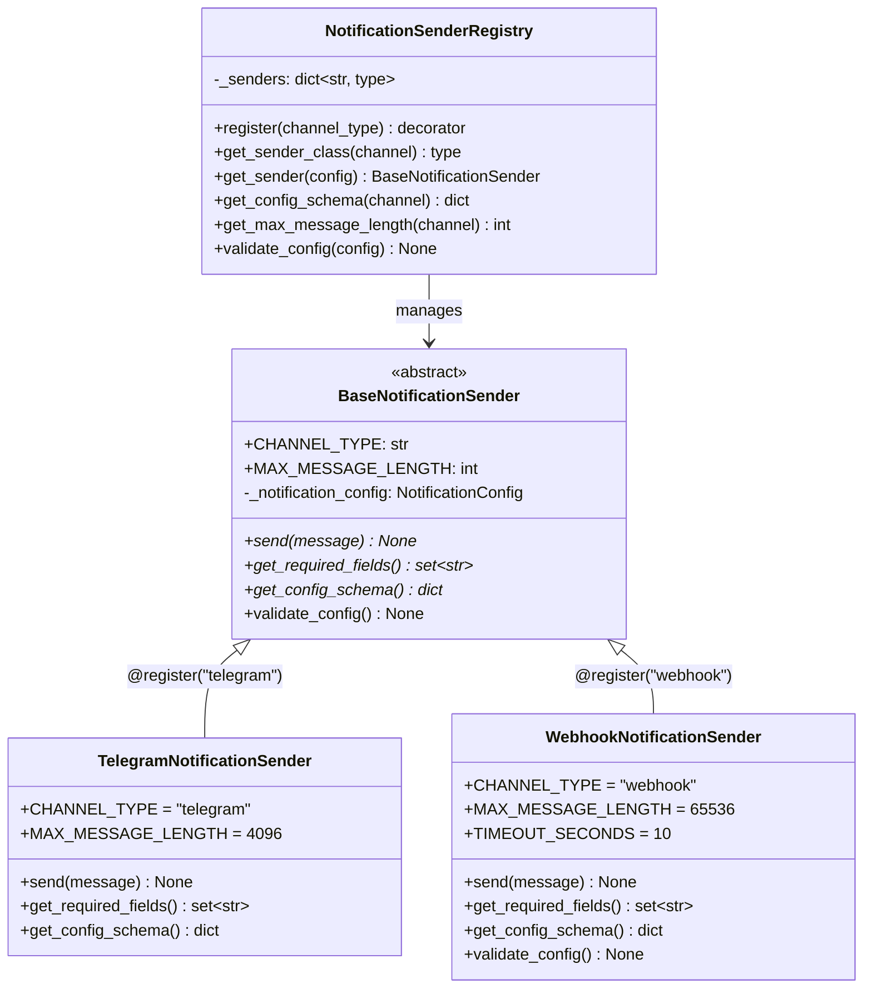
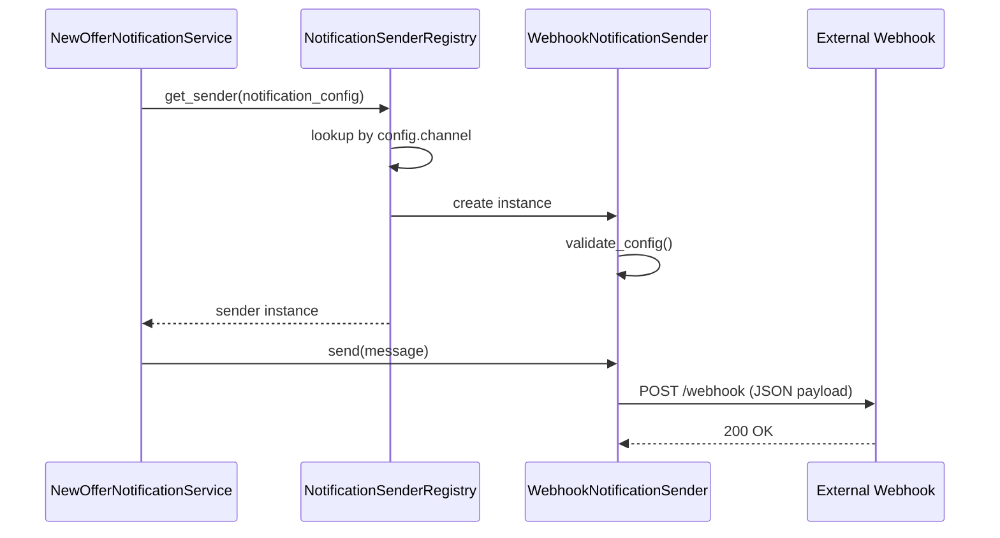

# Story 1.11: Webhook Notification Channel

Status: ready-for-dev

## Story

As a developer or power user,
I want to configure a webhook URL as a notification channel,
so that I can integrate new offer alerts into my own automation systems (e.g., Slack, Discord bots, custom dashboards).

## Acceptance Criteria

**AC1: Webhook Channel Option** - When creating or editing a notification configuration, the user can select "Webhook" as the channel type.

**AC2: Webhook URL Configuration** - When webhook channel is selected, the user can enter a valid HTTPS URL where notifications will be sent.

**AC3: Webhook URL Validation** - The system validates that the webhook URL is a valid HTTPS URL before saving.

**AC4: Webhook Notification Delivery** - When a new offer is detected, the system sends a POST request to the configured webhook URL with the offer data in JSON format.

**AC5: Webhook Payload Schema Documentation** - The webhook payload schema is documented in an accessible location (API docs or dedicated page) so users know how to parse incoming notifications.

**AC6: Webhook Error Handling** - If a webhook delivery fails (timeout, 4xx/5xx response), the system logs the error but does not retry (MVP behavior).

**AC7: Backend Integration** - The webhook sender integrates with the existing notification system architecture using the new Registry pattern.

**AC8: Extensible Architecture** - The notification system uses a Registry + Decorator pattern that allows adding new channels without modifying existing code (Open/Closed Principle).

## Tasks / Subtasks

- [ ] Create NotificationSenderRegistry with decorator-based registration (AC: #8)
  - [ ] Create `shargain/notifications/registry.py` with `NotificationSenderRegistry` class
  - [ ] Implement `@register(channel_type)` decorator
  - [ ] Implement `get_sender_class()` and `get_sender()` factory methods
- [ ] Refactor BaseNotificationSender to be self-describing (AC: #8)
  - [ ] Add `CHANNEL_TYPE` class variable
  - [ ] Add `MAX_MESSAGE_LENGTH` class variable with default
  - [ ] Add abstract `get_required_fields()` method
  - [ ] Add abstract `get_config_schema()` method for API layer
  - [ ] Add `validate_config()` method with default implementation
- [ ] Migrate TelegramNotificationSender to new pattern (AC: #8)
  - [ ] Add `@register("telegram")` decorator
  - [ ] Implement `get_required_fields()` returning `{"chatid"}`
  - [ ] Implement `get_config_schema()` for API schema generation
- [ ] Add WEBHOOK to NotificationChannelChoices enum (AC: #1)
  - [ ] Update `shargain/notifications/models.py` to add `WEBHOOK = "webhook", "Webhook"`
  - [ ] Create Django migration for the new choice
- [ ] Implement WebhookNotificationSender (AC: #2, #3, #4, #6, #7, #8)
  - [ ] Create class with `@register("webhook")` decorator
  - [ ] Implement `get_required_fields()` returning `{"webhook_url"}`
  - [ ] Implement `get_config_schema()` for webhook-specific fields
  - [ ] Override `validate_config()` to enforce HTTPS
  - [ ] Implement `send()` method using `requests.post()`
  - [ ] Add timeout handling (10s timeout)
  - [ ] Add error logging for failed deliveries
- [ ] Define webhook payload schema (AC: #5)
  - [ ] Design JSON schema for offer notifications
  - [ ] Include: offer title, price, url, published_at, scraping_target info
  - [ ] Document schema in code docstrings
- [ ] Refactor NewOfferNotificationService to use registry (AC: #7, #8)
  - [ ] Replace dictionary mapping with `NotificationSenderRegistry.get_sender()`
  - [ ] Use sender's `MAX_MESSAGE_LENGTH` class variable
  - [ ] Remove all channel-specific ifology
- [ ] Create generic config validation using registry (AC: #8)
  - [ ] Add `validate_notification_config()` function that delegates to sender
  - [ ] Use in application commands to avoid ifology
- [ ] Update API layer for webhook support (AC: #1, #2, #3)
  - [ ] Update `CreateNotificationConfigRequest` to use dynamic schema from registry
  - [ ] Update `NotificationConfigResponse` to include webhook_url
  - [ ] Validation happens through registry, not explicit if/else
- [ ] Update DTO layer (AC: #2)
  - [ ] Add webhook_url field to `NotificationConfigDTO`
- [ ] Testing (AC: #4, #6, #7, #8)
  - [ ] Unit tests for NotificationSenderRegistry
  - [ ] Unit tests for WebhookNotificationSender
  - [ ] Test successful webhook delivery
  - [ ] Test webhook timeout handling
  - [ ] Test webhook error response handling (4xx, 5xx)
  - [ ] Test registry auto-discovery of senders
  - [ ] Integration tests for full notification flow
- [ ] Documentation (AC: #5)
  - [ ] Document webhook payload schema
  - [ ] Document how to add new notification channels

## Dev Notes

### Critical Context

**This is a BROWNFIELD story with REFACTORING** - You're adding a webhook channel AND refactoring the notification system to use a proper extensible architecture.

**Goal:** After this story, adding a new notification channel (e.g., Discord, Slack, Email) should require:
1. Creating a new sender class with `@register("channel_name")` decorator
2. Adding the choice to the enum
3. That's it - no other code changes needed!

### Architecture Design: Registry + Decorator Pattern





### Implementation: Registry Class

```python
# File: shargain/notifications/registry.py (NEW FILE)
from __future__ import annotations

import logging
from typing import TYPE_CHECKING, ClassVar

if TYPE_CHECKING:
    from shargain.notifications.models import NotificationConfig

logger = logging.getLogger(__name__)


class NotificationSenderRegistry:
    """
    Registry for notification senders using decorator-based self-registration.

    This pattern follows the Open/Closed Principle:
    - Open for extension: Add new channels by creating a class with @register decorator
    - Closed for modification: No need to modify this class or any mappings

    Usage:
        @NotificationSenderRegistry.register("webhook")
        class WebhookNotificationSender(BaseNotificationSender):
            ...
    """

    _senders: ClassVar[dict[str, type[BaseNotificationSender]]] = {}

    @classmethod
    def register(cls, channel_type: str):
        """Decorator to register a notification sender for a channel type."""
        def decorator(sender_class: type[BaseNotificationSender]):
            if channel_type in cls._senders:
                logger.warning(
                    "Overwriting existing sender for channel '%s': %s -> %s",
                    channel_type,
                    cls._senders[channel_type].__name__,
                    sender_class.__name__
                )
            cls._senders[channel_type] = sender_class
            return sender_class
        return decorator

    @classmethod
    def get_sender_class(cls, channel_type: str) -> type[BaseNotificationSender]:
        """Get the sender class for a channel type."""
        if channel_type not in cls._senders:
            registered = ", ".join(cls._senders.keys()) or "(none)"
            raise ValueError(
                f"No sender registered for channel '{channel_type}'. "
                f"Registered channels: {registered}"
            )
        return cls._senders[channel_type]

    @classmethod
    def get_sender(cls, notification_config: NotificationConfig) -> BaseNotificationSender:
        """Factory method to create a sender instance for a notification config."""
        sender_class = cls.get_sender_class(notification_config.channel)
        return sender_class(notification_config)

    @classmethod
    def get_max_message_length(cls, channel_type: str) -> int:
        """Get the maximum message length for a channel type."""
        sender_class = cls.get_sender_class(channel_type)
        return sender_class.MAX_MESSAGE_LENGTH

    @classmethod
    def validate_config(cls, notification_config: NotificationConfig) -> None:
        """Validate config using the appropriate sender - NO IFOLOGY!"""
        sender_class = cls.get_sender_class(notification_config.channel)
        sender_class(notification_config)  # __init__ calls validate_config()
```

### Implementation: Refactored Senders

```python
# File: shargain/notifications/senders.py (REFACTOR)
import abc
import logging
from typing import ClassVar

import requests
import telebot
from django.conf import settings

from shargain.notifications.registry import NotificationSenderRegistry
from shargain.notifications.models import NotificationConfig

logger = logging.getLogger(__name__)


class BaseNotificationSender(abc.ABC):
    """Abstract base class for notification senders."""

    CHANNEL_TYPE: ClassVar[str]
    MAX_MESSAGE_LENGTH: ClassVar[int] = 65536

    def __init__(self, notification_config: NotificationConfig):
        self._notification_config = notification_config
        self.validate_config()

    @abc.abstractmethod
    def send(self, message: str) -> None:
        pass

    @classmethod
    @abc.abstractmethod
    def get_required_fields(cls) -> set[str]:
        pass

    @classmethod
    @abc.abstractmethod
    def get_config_schema(cls) -> dict:
        pass

    def validate_config(self) -> None:
        """Default validation based on required fields."""
        for field in self.get_required_fields():
            value = getattr(self._notification_config, field, None)
            if not value:
                raise ValueError(
                    f"Missing required field '{field}' for {self.CHANNEL_TYPE} channel"
                )


@NotificationSenderRegistry.register("telegram")
class TelegramNotificationSender(BaseNotificationSender):
    CHANNEL_TYPE = "telegram"
    MAX_MESSAGE_LENGTH = 4096

    def __init__(self, notification_config: NotificationConfig, bot_token: str = ""):
        self._bot_token = bot_token or settings.TELEGRAM_BOT_TOKEN
        assert self._bot_token, "Telegram bot token is not set"
        super().__init__(notification_config)

    @classmethod
    def get_required_fields(cls) -> set[str]:
        return {"chatid"}

    @classmethod
    def get_config_schema(cls) -> dict:
        return {"chat_id": {"type": "string", "required": True}}

    def send(self, message: str) -> None:
        bot = telebot.TeleBot(self._bot_token, parse_mode=None)
        bot.send_message(self._notification_config.chatid, message)


@NotificationSenderRegistry.register("webhook")
class WebhookNotificationSender(BaseNotificationSender):
    CHANNEL_TYPE = "webhook"
    MAX_MESSAGE_LENGTH = 65536
    TIMEOUT_SECONDS = 10

    @classmethod
    def get_required_fields(cls) -> set[str]:
        return {"webhook_url"}

    @classmethod
    def get_config_schema(cls) -> dict:
        return {"webhook_url": {"type": "string", "format": "uri", "required": True}}

    def validate_config(self) -> None:
        super().validate_config()
        if not self._notification_config.webhook_url.startswith("https://"):
            raise ValueError("Webhook URL must use HTTPS")

    def send(self, message: str) -> None:
        webhook_url = self._notification_config.webhook_url
        payload = {
            "type": "new_offers",
            "message": message,
            "notification_config_id": self._notification_config.id,
            "notification_config_name": self._notification_config.name,
        }
        try:
            response = requests.post(webhook_url, json=payload, timeout=self.TIMEOUT_SECONDS)
            response.raise_for_status()
        except requests.Timeout:
            logger.error("Webhook timeout for config %s", self._notification_config.id)
        except requests.RequestException as e:
            logger.error("Webhook failed for config %s: %s", self._notification_config.id, e)
```

### Implementation: Refactored Service (No Ifology!)

```python
# File: shargain/notifications/services/notifications.py (REFACTOR)
from shargain.notifications.registry import NotificationSenderRegistry


class NewOfferNotificationService:
    def __init__(self, offers, scrapping_target):
        self.offers = offers
        self._scrapping_target = scrapping_target

    def run(self):
        message = self.get_message_header()
        max_length = NotificationSenderRegistry.get_max_message_length(
            self._scrapping_target.notification_config.channel
        )
        for offer in self.offers:
            offer_message = self.get_message_for_offer(offer)
            if len(message + offer_message) > max_length:
                self._send(message)
                message = self.get_message_header() + offer_message
            else:
                message += offer_message
        self._send(message)

    def _send(self, message: str) -> None:
        # NO IFOLOGY - registry handles everything!
        sender = NotificationSenderRegistry.get_sender(
            self._scrapping_target.notification_config
        )
        sender.send(message)
```

### Why This Design Avoids Ifology

| Scenario | Old Approach | New Approach |
|----------|--------------|--------------|
| Get sender | `if channel == "telegram": ...` | `Registry.get_sender(config)` |
| Validate | `if channel == "webhook": validate_url()` | `Registry.validate_config(config)` |
| Max length | `{TELEGRAM: 4096}[channel]` | `Registry.get_max_message_length(channel)` |
| Add channel | Modify 5+ files | Add class with `@register` decorator |

### Adding a New Channel (Future)

```python
@NotificationSenderRegistry.register("discord")
class DiscordNotificationSender(BaseNotificationSender):
    CHANNEL_TYPE = "discord"
    MAX_MESSAGE_LENGTH = 2000

    @classmethod
    def get_required_fields(cls) -> set[str]:
        return {"webhook_url"}

    @classmethod
    def get_config_schema(cls) -> dict:
        return {"webhook_url": {"type": "string", "format": "uri", "required": True}}

    def send(self, message: str) -> None:
        requests.post(self._notification_config.webhook_url, json={"content": message})
```

**That's it!** Just add the enum value and the class. No other changes needed.

### Webhook Payload Schema

```json
{
  "type": "new_offers",
  "message": "VINTED\n\nNike Air Max (10:30) za 150zł\nhttps://vinted.pl/...\n\n",
  "notification_config_id": 42,
  "notification_config_name": "My Webhook"
}
```

### Key Files

| File | Action |
|------|--------|
| `shargain/notifications/registry.py` | **CREATE** - Registry class |
| `shargain/notifications/senders.py` | **REFACTOR** - Add decorators, WebhookSender |
| `shargain/notifications/services/notifications.py` | **REFACTOR** - Use registry |
| `shargain/notifications/models.py` | **UPDATE** - Add WEBHOOK enum |
| `shargain/notifications/application/dto.py` | **UPDATE** - Add webhook_url |

### Known Gotchas

⚠️ **Import order** - Senders must be imported for decorators to execute. Import in `__init__.py`.

⚠️ **`webhook_url` field exists** - Don't create duplicate migrations!

⚠️ **DISCORD enum exists** - Not implemented; registry will raise clear error.

### References

- [Source: shargain/notifications/senders.py] - Current sender pattern
- [Source: shargain/notifications/services/notifications.py] - Current service
- [Source: shargain/notifications/models.py:25] - webhook_url field already exists

## Dev Agent Record

### Agent Model Used
### Debug Log References
### Completion Notes List
### File List
