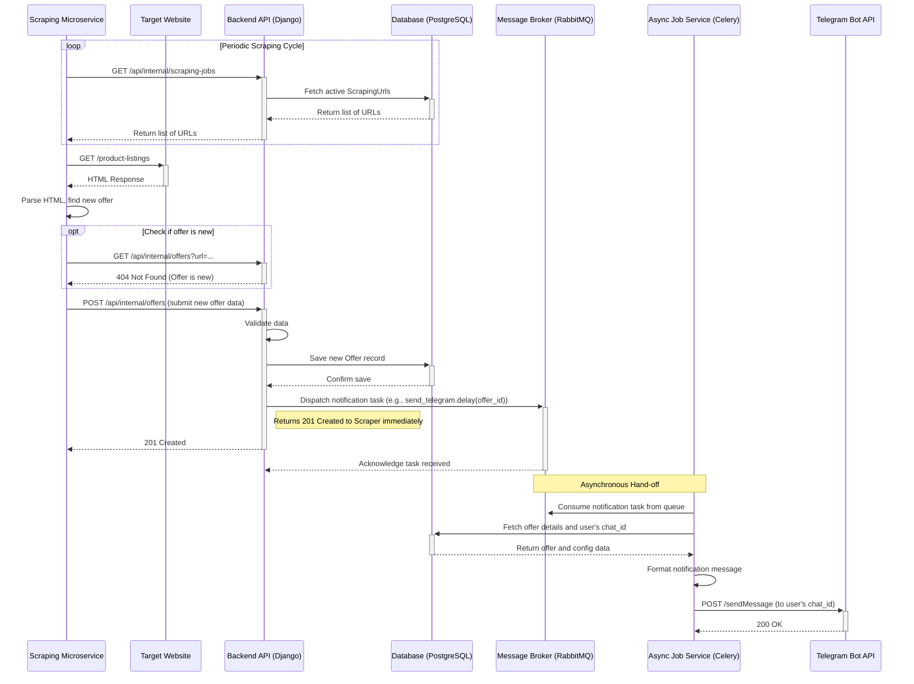
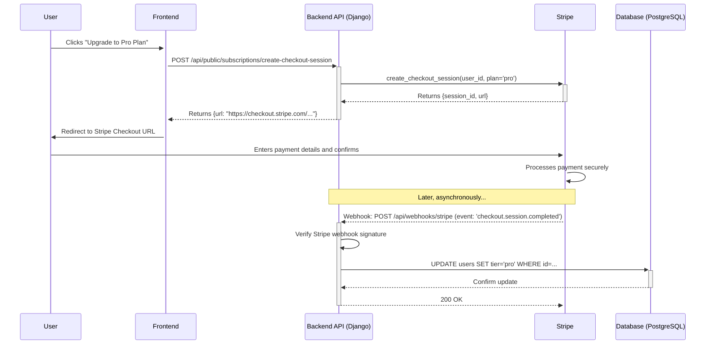

# Core Workflows

This section contains diagrams and descriptions for the primary user journeys and system interactions.

## 1. User Registration & First Login

This workflow describes how a new user creates an account and logs in.

1.  **Initiation:** The user navigates to the signup page on the **Frontend** and submits their credentials (e.g., username, email, password).
2.  **Request:** The **Frontend** sends a `POST` request with the user's details to the `/api/public/auth/signup` endpoint on the **Backend API**.
3.  **Processing:** The **Backend API** validates the submitted data, ensuring the username and email are unique. It then hashes the password and creates a new `User` record in the **Database**.
4.  **Response & Login:** Upon successful creation, the **Backend API** automatically logs the new user in by creating a new session and returning a secure, `HttpOnly` session cookie to the **Frontend**.
5.  **Completion:** The **Frontend** receives the successful response and redirects the user to their dashboard, now as an authenticated user.

## 2. Linking a Notification Channel to a Target

This workflow describes the webhook-driven process for connecting a user's Telegram account to a scraping target.

1.  **Initiation:** While viewing a `ScrappingTarget` on the **Frontend**, the user clicks "Add Notification Channel".
2.  **Redirection:** The **Frontend**, having already generated a unique `register_token` for this action, redirects the user's browser to a special Telegram URL (e.g., `https://t.me/YourBotName?start=<register_token>`).
3.  **User Action:** The user's Telegram client opens, and they click the "START" button to interact with the bot.
4.  **Webhook:** **Telegram's servers** send a webhook (an HTTP POST request) to a pre-configured endpoint on our **Backend API** (e.g., `/api/webhooks/telegram`). This webhook payload contains the `register_token` and the user's unique Telegram `chat_id`.
5.  **Processing:** The **Backend API** receives the webhook. It finds the `register_token` in its system, identifies the associated user, and securely extracts the `chat_id` from the payload.
6.  **Creation & Linking:** The **Backend API** creates a new `NotificationConfig` record in the **Database**, saving the user's `chat_id`. It then programmatically links this new configuration to the `ScrappingTarget` from which the user initiated the process.
7.  **Confirmation (Optional):** The **Backend API** can send a confirmation message back to the user via the Telegram Bot API to confirm the successful link.

## 3. End-to-End Offer Notification (The "Happy Path")

## 4. Subscription Management (Stripe)

## 5. User Deactivates a Target
This is simply a `POST` request to the backend to disable the whole target.
