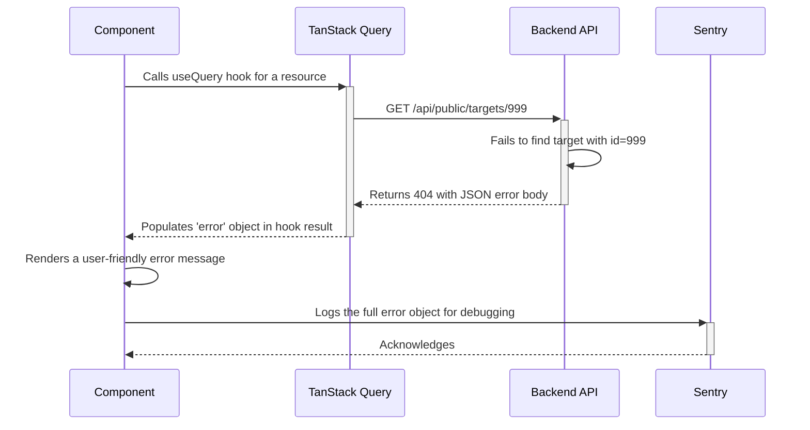

# Error Handling Strategy

## Error Flow Diagram

This diagram shows the flow of an error from the backend to the frontend when a user requests a resource that doesn't exist.



## Error Response Format

All API errors (4xx and 5xx status codes) **MUST** return a JSON body with the following structure. This is based on the `ErrorSchema` found in the OpenAPI specification.

```typescript
interface ApiError {
  detail: string; // A developer-friendly error message.
}
```

## Frontend Error Handling

In the frontend, TanStack Query automatically catches any non-2xx API responses and places the error object into the `error` property of the `useQuery` or `useMutation` result. Components must check for this error state.

```typescript
import { useGetSingleTarget } from '@/lib/api/queries';
import { Alert, AlertDescription, AlertTitle } from '@/components/ui/alert';

const TargetDetail: React.FC<{ targetId: number }> = ({ targetId }) => {
  const { data, isLoading, error } = useGetSingleTarget({ target_id: targetId });

  // 1. Handle the loading state.
  if (isLoading) {
    return <div>Loading...</div>;
  }

  // 2. Handle the error state.
  if (error) {
    // Log the full error for developers.
    console.error(error);
    // Sentry.captureException(error); // Uncomment when Sentry is configured.

    // Show a user-friendly message.
    return (
      <Alert variant="destructive">
        <AlertTitle>Error</AlertTitle>
        <AlertDescription>Could not load the requested target.</AlertDescription>
      </Alert>
    );
  }

  // 3. Render the success state.
  return <h1>{data.name}</h1>;
};
```

## Backend Error Handling

In the backend, Django Ninja should be configured with a global exception handler to catch exceptions and convert them into the standard JSON error format, ensuring a consistent response for all errors.

```python
# In your Django Ninja API configuration
from ninja import NinjaAPI
from django.http import HttpRequest, JsonResponse
from django.core.exceptions import PermissionDenied

api = NinjaAPI()

@api.exception_handler(PermissionDenied)
def permission_denied_handler(request: HttpRequest, exc: PermissionDenied):
    """
    Catches Django's PermissionDenied exception and returns a 403 response.
    """
    return JsonResponse({"detail": "You do not have permission to perform this action."}, status=403)

# Similar handlers should be created for other common exceptions like Http404, ValidationError, etc.
```
