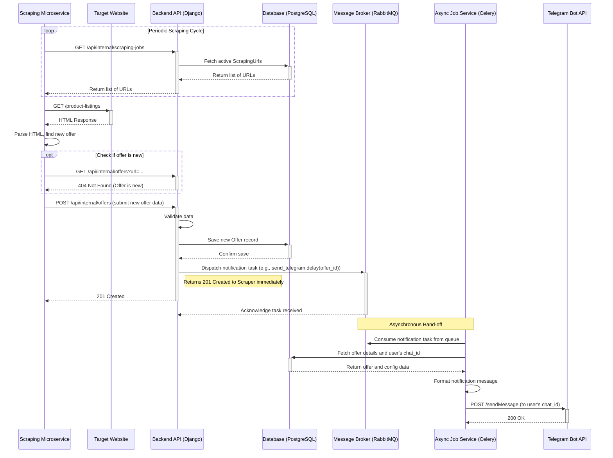
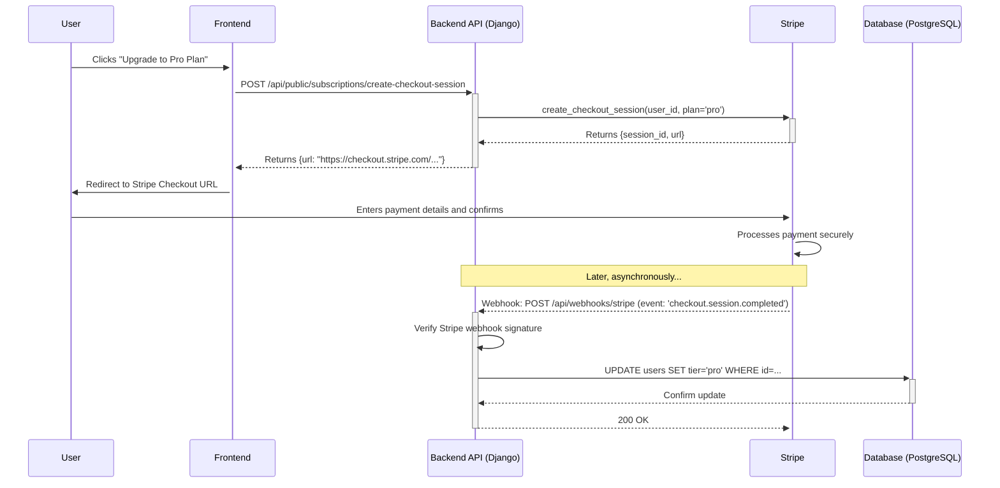

<!-- Powered by BMAD™ Core -->
# Shargain Fullstack Architecture Document

## Introduction

This document outlines the complete fullstack architecture for the Shargain project, including backend systems, frontend implementation, and their integration. It serves as the single source of truth for AI-driven development, ensuring consistency across the entire technology stack.

This unified approach combines what would traditionally be separate backend and frontend architecture documents, streamlining the development process for modern fullstack applications where these concerns are increasingly intertwined.

### Starter Template or Existing Project

N/A - Greenfield project.

### Change Log
| Date | Version | Description | Author |
| :--- | :--- | :--- | :--- |
|      |         |             |        |

## High Level Architecture

### Technical Summary

The Shargain platform is designed as a decoupled system featuring a modern single-page application (SPA) frontend and a robust monolithic backend. The frontend is a React/TypeScript application built with Vite, communicating via a contract-first RESTful API defined with OpenAPI. The backend is a Django application utilizing Django Ninja for efficient API development and Celery for asynchronous task processing. The entire system is containerized using Docker, with Traefik managing ingress and routing in production, ensuring a scalable and maintainable architecture well-suited to the project's goals of providing a reliable second-hand item marketplace.

### Platform and Infrastructure Choice

**Platform:** Self-hosted Infrastructure as a Service (IaaS)
**Key Services:** Docker, Traefik, PostgreSQL, Gunicorn, Celery, RabbitMQ
**Deployment Host and Regions:** Single Linux Virtual Private Server (e.g., AWS EC2, DigitalOcean Droplet) in a primary region (e.g., `eu-central-1`).

### Repository Structure

**Structure:** Monorepo
**Monorepo Tool:** N/A (simple folder-based separation)
**Package Organization:** The project utilizes a simple monorepo structure with two primary top-level directories: `frontend/` for the React SPA and `shargain/` for the Django backend. There is currently no formal monorepo management tool (like Turborepo or Nx), as shared logic is minimal and the API contract serves as the primary interface.

### High Level Architecture Diagram


### Architectural Patterns

-   **Decoupled SPA + API:** The frontend is a standalone Single-Page Application that communicates with the backend exclusively through a stateless API.
    -   *Rationale:* This separation allows independent development, deployment, and scaling of the frontend and backend, promoting a clean division of concerns.
-   **Component-Based UI:** The React frontend is built as a collection of reusable, self-contained components.
    -   *Rationale:* This enhances maintainability, testability, and development speed, as complex UIs can be composed from simpler, independent parts.
-   **Asynchronous Task Processing:** Long-running or non-critical operations are delegated to background workers using Celery.
    -   *Rationale:* This ensures the main API remains responsive and provides a better user experience by not blocking web requests for heavy processing.
-   **API Gateway (Lightweight):** Traefik acts as a single entry point for all incoming traffic, routing to the appropriate service.
    -   *Rationale:* This centralizes concerns like SSL termination, routing, and load balancing, simplifying the architecture of the downstream services.

## Tech Stack

### Technology Stack Table

| Category | Technology | Version | Purpose | Rationale |
| :--- | :--- | :--- | :--- | :--- |
| **Frontend** | | | | |
| Language | TypeScript | `<5.9.0` | Provides static typing for JavaScript. | Enhances code quality, readability, and developer experience. |
| Framework | React | `^19.0.0` | A JavaScript library for building user interfaces. | Component-based architecture and vast ecosystem make it ideal for SPAs. |
| UI Components | shadcn/ui | `latest` | A collection of reusable components built with Radix UI and Tailwind CSS. | Provides accessible, unstyled components that are easy to customize. |
| State Mgmt | TanStack Query | `^5.84.1` | Manages server state, including caching, refetching, and mutations. | Simplifies data fetching and state synchronization with the backend API. |
| CSS Framework | Tailwind CSS | `^4.1.11` | A utility-first CSS framework for rapid UI development. | Allows for building custom designs without leaving your HTML. |
| Build Tool | Vite | `^6.3.5` | A modern frontend build tool that provides an extremely fast development experience. | Offers near-instant server start and Hot Module Replacement (HMR). |
| Testing | Vitest | `^3.0.5` | A fast and modern testing framework for Vite projects. | Seamless integration with Vite and a familiar Jest-like API. |
| **Backend** | | | | |
| Language | Python | `>=3.13` | A high-level, general-purpose programming language. | Strong ecosystem for web development, data science, and more. |
| Framework | Django | `~5.0` | A high-level Python web framework that encourages rapid development. | "Batteries-included" philosophy provides many features out of the box. |
| API Style | Django Ninja | `latest` | A fast, async-ready, and type-hint based API framework for Django. | Enables building modern, OpenAPI-compliant APIs with Pydantic-style schemas. |
| Async Tasks | Celery | `latest` | A distributed task queue for processing asynchronous jobs. | Essential for offloading long-running tasks from the main web thread. |
| **Database** | | | | |
| Main Database | PostgreSQL | `13-alpine` | A powerful, open-source object-relational database system. | Known for its reliability, feature robustness, and performance. |
| Message Broker| RabbitMQ | `latest` | A robust and widely used open-source message broker. | Reliably handles message queuing for Celery's distributed tasks. |
| Cache | Django Cache | `N/A` | Django's built-in caching framework (e.g., in-memory). | Provides basic caching. Can be swapped for Redis if needed. |
| **Infrastructure**| | | | |
| File Storage | Local Filesystem | `N/A` | Stores user-uploaded media on the server's disk. | Simple for development. Recommend AWS S3 for production scalability. |
| Authentication | Django Auth + django-allauth | `latest` | Handles user registration, login, and session management, including OAuth2. | Combines Django's robust system with `django-allauth`'s comprehensive social authentication support. |
| IaC Tool | Docker Compose | `latest` | A tool for defining and running multi-container Docker applications. | Simplifies container orchestration for local development and production. |
| CI/CD | GitHub Actions | `N/A` | Automates the build, test, and deployment pipeline. | Tightly integrated with the GitHub repository for seamless workflow management. |
| Monitoring | Sentry | `latest` | Error tracking and performance monitoring. | Provides real-time insight into application errors and performance. |
| **Testing** | | | | |
| Backend | Pytest | `latest` | A mature, feature-rich testing framework for Python. | Enables writing simple, scalable tests from small units to complex functions. |
| E2E | TBD | `N/A` | End-to-end testing framework. | Recommendation: Playwright for its modern features and cross-browser support. |

## Data Models

### User (Final, Aligned with API)

**Purpose:** Represents an individual account on the platform. A user defines scraping targets to monitor for offers and configures how they receive notifications about new findings.

**Key Attributes:**
- `id`: `integer` - The unique, primary identifier for the user.
- `username`: `string` - The user's public-facing name.
- `email`: `string` - The user's private email address, used for login.
- `tier`: `string` - The user's subscription tier or access level.

#### TypeScript Interface
```typescript
interface User {
  id: number;
  username: string;
  email: string;
  tier: string;
}
```

#### Relationships
-   **One-to-Many:** A `User` has many `ScrappingTarget`s (via the `scraping_targets` related name).
-   **One-to-Many:** A `User` has many `NotificationConfig`s (via the `notification_configs` related name).

### ScrappingTarget

**Purpose:** A user-defined group that contains one or more specific URLs to be monitored for new offers. It serves as the central configuration for a scraping job, linking search pages to a notification channel.

**Key Attributes:**
- `id`: `integer` - The unique, primary identifier for the scraping target.
- `name`: `string` - A user-friendly name for the target group (e.g., "Looking for 15-inch laptops").
- `enable_notifications`: `boolean` - A master switch to enable or disable notifications for all offers found under this target.
- `is_active`: `boolean` - A master switch to enable or disable the scraping process for this target.

#### TypeScript Interface
```typescript
interface ScrappingTarget {
  id: number;
  name: string;
  enable_notifications: boolean;
  is_active: boolean;
  notification_config: number | null; // ID of the NotificationConfig
  owner: string; // UUID of the User
  scraping_urls: ScrapingUrl[]; // Array of associated URLs to be scraped
}

// We will define this next, but including it here for context
interface ScrapingUrl {
  id: number;
  name: string;
  url: string;
  is_active: boolean;
}
```

#### Relationships
-   **Many-to-One:** Belongs to a `User` (the `owner`).
-   **Many-to-One:** Can be linked to one `NotificationConfig`.
-   **One-to-Many:** Has many `ScrapingUrl`s, which contain the actual URLs to scrape.
-   **One-to-Many:** Has many `Offer`s found during scraping.

### ScrapingUrl

**Purpose:** Represents a single, specific URL that the system will actively monitor for offers. It is the "leaf" in the scraping configuration tree, belonging to a parent `ScrappingTarget`.

**Key Attributes:**
- `id`: `integer` - The unique, primary identifier for the scraping URL.
- `name`: `string` - A user-friendly, human-readable name for this specific URL (e.g., "OLX Laptops < $500").
- `url`: `string` - The full URL of the listings page to be scraped.
- `is_active`: `boolean` - A switch to enable or disable scraping for this specific URL.

#### TypeScript Interface
```typescript
interface ScrapingUrl {
  id: number;
  name: string;
  url: string;
  is_active: boolean;
  scraping_target: number; // ID of the parent ScrappingTarget
}
```

#### Relationships
-   **Many-to-One:** Belongs to a `ScrappingTarget`. The `on_delete=models.CASCADE` rule means if the parent `ScrappingTarget` is deleted, all of its associated `ScrapingUrl`s will also be deleted.
-   **One-to-Many:** Has many `ScrapingCheckin`s, which log the history of scraping attempts for this URL.

### Offer

**Purpose:** Represents a single item/listing discovered by the scraper on a target website. It contains all the relevant details of the listing, such as title, price, and image.

**Key Attributes:**
- `id`: `integer` - The unique, primary identifier for the offer in our system.
- `url`: `string` - The direct URL to the offer page on the source website.
- `title`: `string` - The title of the listing (e.g., "Slightly used MacBook Pro").
- `price`: `number` (optional) - The price of the item.
- `main_image_url`: `string` (optional) - The URL of the offer's primary image.
- `list_url`: `string` - The URL of the search/listing page where this offer was found.
- `published_at`: `DateTime` (optional) - The timestamp when the offer was originally published on the source website.
- `closed_at`: `DateTime` (optional) - The timestamp when our system detected that the offer was no longer available.
- `created_at`: `DateTime` - The timestamp when our system first discovered this offer.

#### TypeScript Interface
```typescript
interface Offer {
  id: number;
  url: string;
  title: string;
  price?: number;
  main_image_url?: string;
  list_url: string;
  published_at?: string; // ISO 8601 DateTime
  closed_at?: string; // ISO 8601 DateTime
  created_at: string; // ISO 8601 DateTime
  target: number; // ID of the parent ScrappingTarget
}
```

#### Relationships
-   **Many-to-One:** Belongs to a `ScrappingTarget`. The `on_delete=models.PROTECT` rule is a critical detail: it prevents a `ScrappingTarget` from being deleted if it has associated offers, thus preserving historical data.

### NotificationConfig

**Purpose:** Represents a configured destination channel for sending notifications about new offers. A user can create multiple configurations (e.g., one for Telegram, one for Discord) and assign them to their `ScrappingTarget`s.

**Key Attributes:**
- `id`: `integer` - The unique, primary identifier for the notification configuration.
- `name`: `string` - A user-friendly name for this configuration (e.g., "My Personal Telegram").
- `channel`: `string` - The type of notification channel. This will be an enum of available choices (e.g., "discord", "telegram").
- `register_token`: `string` - A unique token provided to the user to link their chat client (like Telegram) to this configuration.

#### TypeScript Interface
```typescript
enum NotificationChannel {
  DISCORD = 'discord',
  TELEGRAM = 'telegram',
}

interface NotificationConfig {
  id: number;
  name: string;
  channel: NotificationChannel;
  register_token: string;
  owner: string; // UUID of the User
}
```

#### Relationships
-   **Many-to-One:** Belongs to a `User` (the `owner`). If the user is deleted, this configuration is also deleted (`on_delete=models.CASCADE`).
-   **One-to-Many:** Can be used by many `ScrappingTarget`s.

## API Specification

### REST API Specification

```yaml
openapi: 3.0.0
info:
  title: Shargain API
  version: 1.0.0
  description: API for the Shargain platform
servers:
  - url: /api/public
    description: Public API
paths:
  /auth/login:
    post:
      summary: Login
      requestBody:
        required: true
        content:
          application/json:
            schema:
              type: object
              properties:
                email:
                  type: string
                password:
                  type: string
      responses:
        '200':
          description: OK
  /auth/logout:
    post:
      summary: Logout
      responses:
        '200':
          description: OK
  /auth/signup:
    post:
      summary: Signup
      requestBody:
        required: true
        content:
          application/json:
            schema:
              type: object
              properties:
                username:
                  type: string
                email:
                  type: string
                password:
                  type: string
      responses:
        '200':
          description: OK
  /auth/csrf:
    get:
      summary: Get CSRF token
      responses:
        '200':
          description: OK
  /me:
    get:
      summary: Get current user
      responses:
        '200':
          description: OK
          content:
            application/json:
              schema:
                $ref: '#/components/schemas/User'
  /targets:
    get:
      summary: Get all scrapping targets
      responses:
        '200':
          description: OK
          content:
            application/json:
              schema:
                type: array
                items:
                  $ref: '#/components/schemas/ScrappingTarget'
    post:
      summary: Create a scrapping target
      requestBody:
        required: true
        content:
          application/json:
            schema:
              $ref: '#/components/schemas/ScrappingTarget'
      responses:
        '201':
          description: Created
  /targets/{id}:
    get:
      summary: Get a scrapping target
      parameters:
        - name: id
          in: path
          required: true
          schema:
            type: integer
      responses:
        '200':
          description: OK
          content:
            application/json:
              schema:
                $ref: '#/components/schemas/ScrappingTarget'
    put:
      summary: Update a scrapping target
      parameters:
        - name: id
          in: path
          required: true
          schema:
            type: integer
      requestBody:
        required: true
        content:
          application/json:
            schema:
              $ref: '#/components/schemas/ScrappingTarget'
      responses:
        '200':
          description: OK
    delete:
      summary: Delete a scrapping target
      parameters:
        - name: id
          in: path
          required: true
          schema:
            type: integer
      responses:
        '204':
          description: No Content
  /notifications:
    get:
      summary: Get all notification configs
      responses:
        '200':
          description: OK
          content:
            application/json:
              schema:
                type: array
                items:
                  $ref: '#/components/schemas/NotificationConfig'
    post:
      summary: Create a notification config
      requestBody:
        required: true
        content:
          application/json:
            schema:
              $ref: '#/components/schemas/NotificationConfig'
      responses:
        '201':
          description: Created
  /notifications/{id}:
    get:
      summary: Get a notification config
      parameters:
        - name: id
          in: path
          required: true
          schema:
            type: integer
      responses:
        '200':
          description: OK
          content:
            application/json:
              schema:
                $ref: '#/components/schemas/NotificationConfig'
    put:
      summary: Update a notification config
      parameters:
        - name: id
          in: path
          required: true
          schema:
            type: integer
      requestBody:
        required: true
        content:
          application/json:
            schema:
              $ref: '#/components/schemas/NotificationConfig'
      responses:
        '200':
          description: OK
    delete:
      summary: Delete a notification config
      parameters:
        - name: id
          in: path
          required: true
          schema:
            type: integer
      responses:
        '204':
          description: No Content

components:
  schemas:
    User:
      type: object
      properties:
        id:
          type: integer
        username:
          type: string
        email:
          type: string
        tier:
          type: string
    ScrappingTarget:
      type: object
      properties:
        id:
          type: integer
        name:
          type: string
        enable_notifications:
          type: boolean
        is_active:
          type: boolean
        notification_config:
          type: integer
          nullable: true
        owner:
          type: string
          format: uuid
        scraping_urls:
          type: array
          items:
            $ref: '#/components/schemas/ScrapingUrl'
    ScrapingUrl:
      type: object
      properties:
        id:
          type: integer
        name:
          type: string
        url:
          type: string
        is_active:
          type: boolean
        scraping_target:
          type: integer
    NotificationConfig:
      type: object
      properties:
        id:
          type: integer
        name:
          type: string
        channel:
          type: string
          enum:
            - discord
            - telegram
        register_token:
          type: string
        owner:
          type: string
          format: uuid
```

## Data Models

### User (Final, Aligned with API)

**Purpose:** Represents an individual account on the platform. A user defines scraping targets to monitor for offers and configures how they receive notifications about new findings.

**Key Attributes:**
- `id`: `integer` - The unique, primary identifier for the user.
- `username`: `string` - The user's public-facing name.
- `email`: `string` - The user's private email address, used for login.
- `tier`: `string` - The user's subscription tier or access level.

#### TypeScript Interface
```typescript
interface User {
  id: number;
  username: string;
  email: string;
  tier: string;
}
```

#### Relationships
-   **One-to-Many:** A `User` has many `ScrappingTarget`s (via the `scraping_targets` related name).
-   **One-to-Many:** A `User` has many `NotificationConfig`s (via the `notification_configs` related name).

### ScrappingTarget

**Purpose:** A user-defined group that contains one or more specific URLs to be monitored for new offers. It serves as the central configuration for a scraping job, linking search pages to a notification channel.

**Key Attributes:**
- `id`: `integer` - The unique, primary identifier for the scraping target.
- `name`: `string` - A user-friendly name for the target group (e.g., "Looking for 15-inch laptops").
- `enable_notifications`: `boolean` - A master switch to enable or disable notifications for all offers found under this target.
- `is_active`: `boolean` - A master switch to enable or disable the scraping process for this target.

#### TypeScript Interface
```typescript
interface ScrappingTarget {
  id: number;
  name: string;
  enable_notifications: boolean;
  is_active: boolean;
  notification_config: number | null; // ID of the NotificationConfig
  owner: string; // UUID of the User
  scraping_urls: ScrapingUrl[]; // Array of associated URLs to be scraped
}

// We will define this next, but including it here for context
interface ScrapingUrl {
  id: number;
  name: string;
  url: string;
  is_active: boolean;
}
```

#### Relationships
-   **Many-to-One:** Belongs to a `User` (the `owner`).
-   **Many-to-One:** Can be linked to one `NotificationConfig`.
-   **One-to-Many:** Has many `ScrapingUrl`s, which contain the actual URLs to scrape.
-   **One-to-Many:** Has many `Offer`s found during scraping.

### ScrapingUrl

**Purpose:** Represents a single, specific URL that the system will actively monitor for offers. It is the "leaf" in the scraping configuration tree, belonging to a parent `ScrappingTarget`.

**Key Attributes:**
- `id`: `integer` - The unique, primary identifier for the scraping URL.
- `name`: `string` - A user-friendly, human-readable name for this specific URL (e.g., "OLX Laptops < $500").
- `url`: `string` - The full URL of the listings page to be scraped.
- `is_active`: `boolean` - A switch to enable or disable scraping for this specific URL.

#### TypeScript Interface
```typescript
interface ScrapingUrl {
  id: number;
  name: string;
  url: string;
  is_active: boolean;
  scraping_target: number; // ID of the parent ScrappingTarget
}
```

#### Relationships
-   **Many-to-One:** Belongs to a `ScrappingTarget`. The `on_delete=models.CASCADE` rule means if the parent `ScrappingTarget` is deleted, all of its associated `ScrapingUrl`s will also be deleted.
-   **One-to-Many:** Has many `ScrapingCheckin`s, which log the history of scraping attempts for this URL.

### Offer

**Purpose:** Represents a single item/listing discovered by the scraper on a target website. It contains all the relevant details of the listing, such as title, price, and image.

**Key Attributes:**
- `id`: `integer` - The unique, primary identifier for the offer in our system.
- `url`: `string` - The direct URL to the offer page on the source website.
- `title`: `string` - The title of the listing (e.g., "Slightly used MacBook Pro").
- `price`: `number` (optional) - The price of the item.
- `main_image_url`: `string` (optional) - The URL of the offer's primary image.
- `list_url`: `string` - The URL of the search/listing page where this offer was found.
- `published_at`: `DateTime` (optional) - The timestamp when the offer was originally published on the source website.
- `closed_at`: `DateTime` (optional) - The timestamp when our system detected that the offer was no longer available.
- `created_at`: `DateTime` - The timestamp when our system first discovered this offer.

#### TypeScript Interface
```typescript
interface Offer {
  id: number;
  url: string;
  title: string;
  price?: number;
  main_image_url?: string;
  list_url: string;
  published_at?: string; // ISO 8601 DateTime
  closed_at?: string; // ISO 8601 DateTime
  created_at: string; // ISO 8601 DateTime
  target: number; // ID of the parent ScrappingTarget
}
```

#### Relationships
-   **Many-to-One:** Belongs to a `ScrappingTarget`. The `on_delete=models.PROTECT` rule is a critical detail: it prevents a `ScrappingTarget` from being deleted if it has associated offers, thus preserving historical data.

### NotificationConfig

**Purpose:** Represents a configured destination channel for sending notifications about new offers. A user can create multiple configurations (e.g., one for Telegram, one for Discord) and assign them to their `ScrappingTarget`s.

**Key Attributes:**
- `id`: `integer` - The unique, primary identifier for the notification configuration.
- `name`: `string` - A user-friendly name for this configuration (e.g., "My Personal Telegram").
- `channel`: `string` - The type of notification channel. This will be an enum of available choices (e.g., "discord", "telegram").
- `register_token`: `string` - A unique token provided to the user to link their chat client (like Telegram) to this configuration.

#### TypeScript Interface
```typescript
enum NotificationChannel {
  DISCORD = 'discord',
  TELEGRAM = 'telegram',
}

interface NotificationConfig {
  id: number;
  name: string;
  channel: NotificationChannel;
  register_token: string;
  owner: string; // UUID of the User
}
```

#### Relationships
-   **Many-to-One:** Belongs to a `User` (the `owner`). If the user is deleted, this configuration is also deleted (`on_delete=models.CASCADE`).
-   **One-to-Many:** Can be used by many `ScrappingTarget`s.

## API Specification

### REST API Specification

```yaml
openapi: 3.0.0
info:
  title: Shargain API
  version: 1.0.0
  description: API for the Shargain platform
servers:
  - url: /api/public
    description: Public API

paths:
  /auth/login:
    post:
      summary: Login
      requestBody:
        required: true
        content:
          application/json:
            schema:
              type: object
              properties:
                email:
                  type: string
                password:
                  type: string
      responses:
        '200':
          description: OK
  /auth/logout:
    post:
      summary: Logout
      responses:
        '200':
          description: OK
  /auth/signup:
    post:
      summary: Signup
      requestBody:
        required: true
        content:
          application/json:
            schema:
              type: object
              properties:
                username:
                  type: string
                email:
                  type: string
                password:
                  type: string
      responses:
        '200':
          description: OK
  /auth/csrf:
    get:
      summary: Get CSRF token
      responses:
        '200':
          description: OK
  /me:
    get:
      summary: Get current user
      responses:
        '200':
          description: OK
          content:
            application/json:
              schema:
                $ref: '#/components/schemas/User'
  /targets:
    get:
      summary: Get all scrapping targets
      responses:
        '200':
          description: OK
          content:
            application/json:
              schema:
                type: array
                items:
                  $ref: '#/components/schemas/ScrappingTarget'
    post:
      summary: Create a scrapping target
      requestBody:
        required: true
        content:
          application/json:
            schema:
              $ref: '#/components/schemas/ScrappingTarget'
      responses:
        '201':
          description: Created
  /targets/{id}:
    get:
      summary: Get a scrapping target
      parameters:
        - name: id
          in: path
          required: true
          schema:
            type: integer
      responses:
        '200':
          description: OK
          content:
            application/json:
              schema:
                $ref: '#/components/schemas/ScrappingTarget'
    put:
      summary: Update a scrapping target
      parameters:
        - name: id
          in: path
          required: true
          schema:
            type: integer
      requestBody:
        required: true
        content:
          application/json:
            schema:
              $ref: '#/components/schemas/ScrappingTarget'
      responses:
        '200':
          description: OK
    delete:
      summary: Delete a scrapping target
      parameters:
        - name: id
          in: path
          required: true
          schema:
            type: integer
      responses:
        '204':
          description: No Content
  /notifications:
    get:
      summary: Get all notification configs
      responses:
        '200':
          description: OK
          content:
            application/json:
              schema:
                type: array
                items:
                  $ref: '#/components/schemas/NotificationConfig'
    post:
      summary: Create a notification config
      requestBody:
        required: true
        content:
          application/json:
            schema:
              $ref: '#/components/schemas/NotificationConfig'
      responses:
        '201':
          description: Created
  /notifications/{id}:
    get:
      summary: Get a notification config
      parameters:
        - name: id
          in: path
          required: true
          schema:
            type: integer
      responses:
        '200':
          description: OK
          content:
            application/json:
              schema:
                $ref: '#/components/schemas/NotificationConfig'
    put:
      summary: Update a notification config
      parameters:
        - name: id
          in: path
          required: true
          schema:
            type: integer
      requestBody:
        required: true
        content:
          application/json:
            schema:
              $ref: '#/components/schemas/NotificationConfig'
      responses:
        '200':
          description: OK
    delete:
      summary: Delete a notification config
      parameters:
        - name: id
          in: path
          required: true
          schema:
            type: integer
      responses:
        '204':
          description: No Content

components:
  schemas:
    User:
      type: object
      properties:
        id:
          type: integer
        username:
          type: string
        email:
          type: string
        tier:
          type: string
    ScrappingTarget:
      type: object
      properties:
        id:
          type: integer
        name:
          type: string
        enable_notifications:
          type: boolean
        is_active:
          type: boolean
        notification_config:
          type: integer
          nullable: true
        owner:
          type: string
          format: uuid
        scraping_urls:
          type: array
          items:
            $ref: '#/components/schemas/ScrapingUrl'
    ScrapingUrl:
      type: object
      properties:
        id:
          type: integer
        name:
          type: string
        url:
          type: string
        is_active:
          type: boolean
        scraping_target:
          type: integer
    NotificationConfig:
      type: object
      properties:
        id:
          type: integer
        name:
          type: string
        channel:
          type: string
          enum:
            - discord
            - telegram
        register_token:
          type: string
        owner:
          type: string
          format: uuid
```

## Components

### Frontend Application (React SPA)

-   **Responsibility:** To provide the configuration interface for the Shargain platform. Its purpose is to allow users to manage their account, scraping targets, and notification channels. **It is explicitly out of scope for this component to display the offers discovered by the scraper.** Users receive offers only via their configured notification channels (e.g., Telegram, Discord).
-   **Key Interfaces:** Consumes the backend REST API for all data and business operations. It does not have any direct access to the database or other backend services.
-   **Dependencies:** Depends entirely on the **Backend API** to function.
-   **Technology Stack:** React 19, Vite, TypeScript, TanStack Router, TanStack Query, Tailwind CSS.

### Scraping Microservice (External)

-   **Responsibility:** To operate as a fully independent service that drives the scraping process. It periodically polls the main backend for jobs, executes the scraping, and pushes the results back.
-   **Key Interfaces:**
    -   Makes scheduled `GET` requests to the **Backend API** to fetch a list of active `ScrapingUrl`s.
    -   Makes `POST` or `PUT` requests to the **Backend API** to submit the discovered `Offer` data.
    -   Makes outbound HTTP requests to the external websites being scraped.
-   **Dependencies:**
    -   **Backend API:** Relies on the main application's API being available to fetch jobs and submit results.
    -   **External Websites:** Dependent on the availability and structure of the target websites.
-   **Technology Stack:** Independent of this project. The specific technologies are not relevant to this architecture, only its interfaces are.

### Backend API (Django)

-   **Responsibility:** To serve the frontend application, manage core data, and provide an interface for the external scraper. Its duties include:
    -   Handling user authentication and account management.
    -   Exposing a REST API for the **Frontend Application** to manage configurations.
    -   **Exposing a secure, internal API endpoint to provide active `ScrapingUrl` data to the external Scraping Microservice.**
    -   **Exposing a secure, internal API endpoint to receive `Offer` data from the Scraping Microservice.**
    -   Dispatching notification tasks to the **Async Job Service (Celery)** after new offers are received.
-   **Key Interfaces:**
    -   Exposes a public RESTful API for the **Frontend Application**.
    -   **Exposes an internal-facing RESTful API for the Scraping Microservice.** This should be secured via an API key or other non-session-based mechanism.
    -   Connects to the **Database** (PostgreSQL).
    -   Connects to the **Message Broker** (RabbitMQ).
-   **Dependencies:**
    -   **Database (PostgreSQL)**
    -   **Message Broker (RabbitMQ)**
    -   **Async Job Service (Celery)**
-   **Technology Stack:** Django, Django Ninja, Python, Gunicorn.

### Component Diagrams

```mermaid
graph TD
    subgraph "User"
        U[User's Browser]
    end

    subgraph "Shargain System (Hosted on IaaS)"
        T[Traefik Reverse Proxy]

        subgraph "Frontend"
            F[React SPA <br>(Nginx Container)]
        end

        subgraph "Backend"
            B[Backend API <br>(Django/Gunicorn Container)]
            C[Async Job Service <br>(Celery Container)]
            DB[(PostgreSQL Database)]
            MQ[(RabbitMQ Broker)]
        end
    end

    subgraph "External Services"
        S[Scraping Microservice]
        W[Target Websites]
        N[Notification Services <br>(e.g., Telegram API)]
    end

    U -- "Interacts with" --> F
    F -- "API Calls (HTTPS)" --> T
    T -- "Serves Static Files" --> F
    T -- "Forwards API Traffic" --> B

    B -- "Reads/Writes Data" --> DB
    B -- "Dispatches Jobs" --> MQ
    C -- "Consumes Jobs" --> MQ
    C -- "Reads/Writes Data" --> DB
    C -- "Sends Notifications" --> N

    S -- "Fetches Scraping Jobs (Internal API)" --> B
    S -- "Submits Found Offers (Internal API)" --> B
    S -- "Scrapes" --> W
```

## External APIs

### Telegram Bot API

-   **Purpose:** To send notifications about newly found offers to users who have configured a Telegram channel.
-   **Documentation:** `https://core.telegram.org/bots/api`
-   **Base URL(s):** `https://api.telegram.org/bot<token>/`
-   **Authentication:** A secret Bot Token, which is included in the request URL. This token must be stored securely as an environment variable and should never be exposed client-side.
-   **Rate Limits:** The API has rate limits that must be respected. While high, bulk notifications should be sent with care, potentially with small delays between messages to avoid being flagged.

**Key Endpoints Used:**
-   `POST /sendMessage` - This is the primary endpoint used to send a text message to a specific chat ID. The message content will include the offer's title, price, and a direct link.

**Integration Notes:**
-   The `Async Job Service (Celery)` is solely responsible for making outbound calls to this API.
-   The application must gracefully handle potential errors, such as an invalid `chat_id` (if a user revokes permission) or network failures.
-   The `register_token` in the `NotificationConfig` model is used to associate a user's Telegram `chat_id` with their Shargain account during a one-time setup flow.

### Target Websites (e.g., OLX, Vinted)

-   **Purpose:** To serve as the source of data (offers) for the **Scraping Microservice**.
-   **Documentation:** N/A. There is no official, public API. The "contract" is the website's HTML structure, which is volatile and subject to change without any notice.
-   **Base URL(s):** The specific URLs of the search/listing pages provided by users in the `ScrapingUrl` entries.
-   **Authentication:** Not typically required for accessing public listings. However, the scraper may need to manage cookies or a basic session to mimic a regular user and avoid detection.
-   **Rate Limits:** While there are no published rate limits, overly aggressive or rapid-fire requests will likely result in temporary IP bans, CAPTCHA challenges, or other anti-bot measures.

**Integration Notes:**
-   **High Instability:** This is the most fragile part of the system. The scraping logic must be designed for resilience and adaptability, as changes to the target websites' HTML layout are expected and will break the scraper.
-   **"Good Citizen" Scraping:** The **Scraping Microservice** must be configured to be respectful. This includes using realistic user-agents, introducing randomized delays between requests, and potentially rotating IP addresses to avoid being blocked.
-   **Maintenance Overhead:** A significant portion of ongoing maintenance for this project will likely be updating the scraper to adapt to changes on these target websites.

## Core Workflows

This section contains diagrams and descriptions for the primary user journeys and system interactions.

### 1. User Registration & First Login

This workflow describes how a new user creates an account and logs in.

1.  **Initiation:** The user navigates to the signup page on the **Frontend** and submits their credentials (e.g., username, email, password).
2.  **Request:** The **Frontend** sends a `POST` request with the user's details to the `/api/public/auth/signup` endpoint on the **Backend API**.
3.  **Processing:** The **Backend API** validates the submitted data, ensuring the username and email are unique. It then hashes the password and creates a new `User` record in the **Database**.
4.  **Response & Login:** Upon successful creation, the **Backend API** automatically logs the new user in by creating a new session and returning a secure, `HttpOnly` session cookie to the **Frontend**.
5.  **Completion:** The **Frontend** receives the successful response and redirects the user to their dashboard, now as an authenticated user.

### 2. Linking a Notification Channel to a Target

This workflow describes the webhook-driven process for connecting a user's Telegram account to a scraping target.

1.  **Initiation:** While viewing a `ScrappingTarget` on the **Frontend**, the user clicks "Add Notification Channel".
2.  **Redirection:** The **Frontend**, having already generated a unique `register_token` for this action, redirects the user's browser to a special Telegram URL (e.g., `https://t.me/YourBotName?start=<register_token>`).
3.  **User Action:** The user's Telegram client opens, and they click the "START" button to interact with the bot.
4.  **Webhook:** **Telegram's servers** send a webhook (an HTTP POST request) to a pre-configured endpoint on our **Backend API** (e.g., `/api/webhooks/telegram`). This webhook payload contains the `register_token` and the user's unique Telegram `chat_id`.
5.  **Processing:** The **Backend API** receives the webhook. It finds the `register_token` in its system, identifies the associated user, and securely extracts the `chat_id` from the payload.
6.  **Creation & Linking:** The **Backend API** creates a new `NotificationConfig` record in the **Database**, saving the user's `chat_id`. It then programmatically links this new configuration to the `ScrappingTarget` from which the user initiated the process.
7.  **Confirmation (Optional):** The **Backend API** can send a confirmation message back to the user via the Telegram Bot API to confirm the successful link.

### 3. End-to-End Offer Notification (The "Happy Path")



### 4. Subscription Management (Stripe)



### 5. User Deactivates a Target
This is simply a `POST` request to the backend to disable the whole target.

## Database Schema

This section provides the definitive database schema as SQL DDL (Data Definition Language) statements for PostgreSQL. This reflects the Django models and their relationships.

```sql
-- Note: This schema is a representation of the Django models.
-- Django automatically creates tables like 'accounts_user' based on the app and model name.

-- Represents the core user model, likely extending Django's built-in AbstractUser.
CREATE TABLE "accounts_user" (
    "id" bigserial NOT NULL PRIMARY KEY,
    "password" varchar(128) NOT NULL,
    "last_login" timestamptz NULL,
    "is_superuser" boolean NOT NULL,
    "username" varchar(150) NOT NULL UNIQUE,
    "first_name" varchar(150) NOT NULL,
    "last_name" varchar(150) NOT NULL,
    "email" varchar(254) NOT NULL,
    "is_staff" boolean NOT NULL,
    "is_active" boolean NOT NULL,
    "date_joined" timestamptz NOT NULL,
    "tier" varchar(50) NOT NULL DEFAULT 'free'
);

-- Configuration for a notification channel (e.g., Telegram, Discord).
CREATE TABLE "notifications_notificationconfig" (
    "id" bigserial NOT NULL PRIMARY KEY,
    "name" varchar(100) NOT NULL,
    "channel" varchar(50) NOT NULL, -- e.g., 'telegram', 'discord'
    "register_token" varchar(255) NOT NULL UNIQUE,
    "owner_id" bigint NOT NULL REFERENCES "accounts_user" ("id") ON DELETE CASCADE
);

-- A group of URLs to be scraped, linked to a user and a notification channel.
CREATE TABLE "offers_scrappingtarget" (
    "id" bigserial NOT NULL PRIMARY KEY,
    "name" varchar(200) NOT NULL,
    "enable_notifications" boolean NOT NULL,
    "is_active" boolean NOT NULL,
    "notification_config_id" bigint NULL REFERENCES "notifications_notificationconfig" ("id") ON DELETE SET NULL,
    "owner_id" bigint NOT NULL REFERENCES "accounts_user" ("id") ON DELETE CASCADE
);

-- A single URL to be scraped, belonging to a ScrappingTarget.
CREATE TABLE "offers_scrapingurl" (
    "id" bigserial NOT NULL PRIMARY KEY,
    "name" varchar(200) NOT NULL,
    "url" text NOT NULL,
    "is_active" boolean NOT NULL,
    "scraping_target_id" bigint NOT NULL REFERENCES "offers_scrappingtarget" ("id") ON DELETE CASCADE
);

-- An item/listing discovered by the scraper.
CREATE TABLE "offers_offer" (
    "id" bigserial NOT NULL PRIMARY KEY,
    "url" text NOT NULL,
    "title" varchar(500) NOT NULL,
    "price" decimal(10, 2) NULL,
    "main_image_url" text NULL,
    "list_url" text NOT NULL,
    "published_at" timestamptz NULL,
    "closed_at" timestamptz NULL,
    "created_at" timestamptz NOT NULL,
    "target_id" bigint NOT NULL,
    -- The ON DELETE PROTECT rule is enforced at the application level by Django.
    -- Adding a non-deferrable foreign key constraint achieves a similar result at the DB level.
    CONSTRAINT "offers_offer_target_id_fk_offers_scrappingtarget"
        FOREIGN KEY ("target_id") REFERENCES "offers_scrappingtarget" ("id") ON DELETE RESTRICT
);

-- Add indexes for frequently queried columns
CREATE INDEX "notifications_notificationconfig_owner_id_idx" ON "notifications_notificationconfig" ("owner_id");
CREATE INDEX "offers_scrappingtarget_owner_id_idx" ON "offers_scrappingtarget" ("owner_id");
CREATE INDEX "offers_scrapingurl_scraping_target_id_idx" ON "offers_scrapingurl" ("scraping_target_id");
CREATE INDEX "offers_offer_target_id_idx" ON "offers_offer" ("target_id");
CREATE INDEX "offers_offer_created_at_idx" ON "offers_offer" ("created_at");

```

## Frontend Architecture

This section defines the specific architectural patterns, folder structure, and conventions for the React Single-Page Application (SPA).

### Folder Structure

The `frontend/src/` directory is organized to promote scalability, maintainability, and a clear separation of concerns.

```plaintext
src/
├── components/
│   ├── common/         # Custom, reusable components (e.g., PageHeader, DataTable)
│   ├── features/       # Components specific to a feature (e.g., target-form)
│   └── ui/             # Unstyled base components from shadcn/ui (Button, Input)
├── hooks/              # Custom React hooks for reusable logic (e.g., use-media-query)
├── lib/
│   ├── api/            # Auto-generated API client and TanStack Query hooks (DO NOT EDIT)
│   └── utils.ts        # Shared utility functions (e.g., cn for classnames)
├── routes/             # File-based routing definitions for TanStack Router
│   ├── __root.tsx      # The root layout component for the entire app
│   ├── index.tsx       # The component for the '/' route (landing page)
│   └── dashboard.tsx   # The component for the '/dashboard' route
└── types/              # Shared TypeScript types and interfaces (if not from API)
```

### Component Strategy

Our strategy is centered around composition, leveraging `shadcn/ui` as a primitive component library.

1.  **Primitives First:** All UI elements are built upon the unstyled, accessible primitives found in `src/components/ui/`. These are the foundational building blocks.
2.  **Composition:** We create custom, reusable components (e.g., a `DataTable` with sorting and filtering) by composing these primitives. These live in `src/components/common/`.
3.  **Feature-Specific Components:** Components that are only used within a single feature or route (e.g., a complex form for creating a `ScrappingTarget`) are located in `src/components/features/`.
4.  **Smart vs. Dumb Components:**
    -   **Smart Components (Containers):** These are typically the route-level components found in `src/routes/`. Their primary responsibility is to fetch data using TanStack Query hooks and manage application state. They then pass this data down to presentational components as props.
    -   **Dumb Components (Presentational):** The majority of components (in `common/` and `features/`) are "dumb." They receive data and callbacks via props, render the UI, and have little to no internal state of their own. This makes them highly reusable and easy to test.

### State Management

We strictly differentiate between server state and client state.

-   **Server State:** Exclusively managed by **TanStack Query**. This is the source of truth for any data that comes from the backend. It handles all caching, background refetching, and optimistic updates for mutations. There should be no other stores (like Redux or Zustand) for server data.
-   **Global UI State:** For minimal, app-wide UI state (e.g., theme preference, mobile navigation visibility), we will use React's built-in **Context API**. A lightweight library like Zustand will only be considered if performance with the Context API becomes a demonstrable issue.
-   **Local Component State:** State that is confined to a single component (e.g., the current value of an input field) should be managed with standard `useState` and `useReducer` hooks.

### Routing

Routing is handled by **TanStack Router** using its file-based routing engine.

-   **File-based:** The URL structure of the application is determined by the file and folder hierarchy within the `src/routes/` directory.
-   **Layouts:** The `__root.tsx` file defines the root layout that wraps all pages. Nested layouts can be created by creating new directories with their own layout files.
-   **Data Loading:** Data for a route should be pre-fetched using the `loader` function provided by TanStack Router. This integrates seamlessly with TanStack Query to ensure data is available before a page component renders, which helps prevent loading spinners from flickering on screen.

### API Interaction

This is a critical rule for maintaining type safety and consistency.

-   **Generated Client is King:** All communication with the backend REST API **MUST** go through the auto-generated TanStack Query hooks located in `src/lib/api/`. The `pnpm generate:api-client` command is the source of truth for this client.
-   **No Direct `fetch` or `axios`:** Direct, manual use of `fetch` or other HTTP clients (like `axios`) for interacting with the backend API is strictly forbidden. Using the generated hooks ensures that all API calls are type-safe and that server state is managed correctly by TanStack Query.

## Backend Architecture

This section describes the architecture of the backend system, which is a modular monolith Django application designed for clarity, security, and performance.

### Application Structure (Django Apps)

The backend is organized into several discrete Django applications, each with a single, well-defined responsibility. This modular approach simplifies development and maintenance.

-   `shargain/accounts/`: Manages user models, profiles, and authentication. It integrates with `django-allauth` to handle registration and login flows (including social auth if configured).
-   `shargain/offers/`: The core application containing the primary business models: `ScrappingTarget`, `ScrapingUrl`, and `Offer`. It holds the logic for managing these resources. The business logic mainly lives in `shargain/offers/application/` directory which contains commands and queries which are interface to the rest of the application.
-   `shargain/notifications/`: Manages `NotificationConfig` models and contains the business logic for preparing and dispatching notifications to the async task queue.
-   `shargain/public_api/`: This app serves as the primary entry point for the REST API. It initializes the `NinjaAPI` instance and includes modular `APIRouter` instances from the other applications to construct the complete `openapi.json` specification.

### API Design with Django Ninja

Our API design philosophy prioritizes type safety, automatic documentation, and developer efficiency.

-   **Contract-First via Code:** We use Django Ninja to automatically generate the `openapi.json` specification from our Python code. Type hints and Pydantic schemas define the API contract, ensuring the implementation and documentation are always synchronized.
-   **Schema Validation:** All incoming request data (bodies, query parameters) is automatically validated against Pydantic schemas. This provides robust data integrity at the edge of the application, preventing invalid data from reaching the business logic.
-   **Modular Routers:** To keep the API code organized, each Django app exposes its own `APIRouter`. These routers are then included in the main `NinjaAPI` instance in the `public_api` app. This allows API endpoints to live alongside the models and logic they relate to.

### Authentication and Authorization

Security is handled with a multi-layered approach.

-   **Frontend Authentication:** The primary mechanism is **session-based authentication**. After a user logs in, Django sets a secure, `HttpOnly` session cookie. This cookie is automatically sent by the browser on subsequent requests and is not accessible to JavaScript, mitigating the risk of XSS-based token theft.
-   **Internal API Authentication:** The endpoints for the `Scraping Microservice` will be secured using a simple **API Key**. The scraper will include a pre-shared secret in an HTTP header, which will be validated by a custom Django Ninja authentication class.
-   **Authorization:** Permissions are enforced within each API view. For any action on a resource, the backend logic **MUST** first verify that the authenticated user (`request.user`) is the owner of that resource. This prevents one user from accessing or modifying another user's data.

### Asynchronous Task Processing (Celery)

To ensure the API remains fast and responsive, any operation that is not instantaneous is delegated to a background task.

-   **Flow:**
    1.  **Dispatch:** When a long-running action is triggered (e.g., sending a notification), the API view calls `.delay()` on a Celery task function (e.g., `send_telegram_notification.delay(offer_id)`).
    2.  **Queue:** This action places a message describing the job onto a **RabbitMQ** queue and the API returns an immediate response to the client.
    3.  **Execution:** An independent **Celery worker** process continually monitors the queue. It picks up the job message and executes the task function in the background, without blocking the web server.

### Database Access

-   **Django ORM:** All database interactions are performed exclusively through the Django Object-Relational Mapper (ORM). Direct SQL queries are forbidden. This provides a secure, abstract interface for database operations, preventing SQL injection vulnerabilities and making the code more portable and readable.
-   **Migrations:** The database schema is managed declaratively via Django models. Schema changes are version-controlled and applied using Django's built-in migration system (`makemigrations` and `migrate`).

## Source Tree

The project is organized as a monorepo, containing the frontend, backend, and all related configuration in a single Git repository. This co-location simplifies cross-stack development and ensures consistency.

```plaintext
shargain/ (Monorepo Root)
├── .github/                    # CI/CD workflows (GitHub Actions)
├── docs/                       # Project documentation
│   └── architecture.md         # This document
├── frontend/                   # React SPA (The Frontend Application)
│   ├── src/
│   │   ├── components/         # React components
│   │   ├── routes/             # File-based routing
│   │   └── lib/
│   │       └── api/            # Auto-generated API client and hooks
│   ├── public/                 # Static assets
│   ├── openapi.json            # The API contract
│   └── package.json            # Frontend dependencies
├── shargain/                   # Django Project (The Backend API)
│   ├── accounts/               # User management app
│   ├── offers/                 # Offer and ScrappingTarget models
│   ├── notifications/          # Notification models and logic
│   ├── public_api/             # API endpoint definitions
│   ├── settings/               # Django settings
│   └── manage.py               # Django management script
├── .gitignore
├── compose.yml                 # Production Docker configuration
├── docker-compose.yml          # Local development Docker configuration
└── pyproject.toml              # Backend dependencies
```

## Development Workflow

### Local Development Setup

#### Prerequisites

Before you begin, ensure you have the following tools installed on your system:
-   Docker & Docker Compose
-   `pnpm` (for frontend package management)
-   `uv` (for backend Python package management)

#### Initial Setup

To set up the project for the first time, follow these steps:

```bash
# 1. Clone the repository
git clone <repository_url>
cd shargain

# 2. Set up environment variables for the backend
cp .env.example .env
# (Then edit .env with your local secrets)

# 3. Install frontend dependencies
cd frontend
pnpm install

# 4. Generate the API client
pnpm generate:api-client
cd ..

# 5. Build and start the backend services (database, etc.)
docker-compose up --build -d
```

#### Development Commands

Once the initial setup is complete, use these commands for daily development:

```bash
# Start all services (backend API, database, etc.)
docker-compose up

# Start only the frontend development server (in a separate terminal)
cd frontend && pnpm dev

# Run frontend tests
cd frontend && pnpm test

# Run backend tests
pytest shargain/
```

### Environment Configuration

#### Required Environment Variables

-   **Backend (`.env`):**
    -   `SECRET_KEY`: Django's secret key for cryptographic signing.
    -   `POSTGRES_DB`, `POSTGRES_USER`, `POSTGRES_PASSWORD`: Credentials for the database.
    -   `TELEGRAM_BOT_TOKEN`: The secret token for the Telegram Bot API.

-   **Frontend (`frontend/.env.development`):**
    -   `VITE_API_URL`: The full URL to the local backend API (e.g., `http://localhost:8000`).

## Deployment Architecture

### Deployment Strategy

The entire application is deployed as a set of Docker containers, orchestrated by Docker Compose on a single server.

-   **Frontend Deployment:**
    -   **Platform:** The frontend is built into a static bundle and placed into a lightweight Nginx Docker container.
    -   **Build Command:** `pnpm build`
    -   **Output Directory:** `dist`
    -   **CDN/Edge:** Traefik serves the static files directly. For higher performance, a CDN like Cloudflare could be placed in front of the entire application.

-   **Backend Deployment:**
    -   **Platform:** The Django application is deployed as a Docker container using Gunicorn as the WSGI server.
    -   **Build Command:** `docker compose -f compose.yml build backend`
    -   **Deployment Method:** The production `compose.yml` file is run on the server, which starts the `backend` API container, runs database `migrations`, and collects static files.

### CI/CD Pipeline

We use a system called GitHub Actions to create an automated assembly line for our code. Whenever a developer merges new code into the `main` branch, this assembly line kicks off automatically to ensure the code is tested and safely deployed to our live server.

The process works in three main stages:

1.  **Stage 1: Run All Tests**
    -   First, the system acts as a quality checker. It automatically runs every single test for both the frontend and the backend.
    -   **Goal:** To catch bugs early. If even one test fails, the process stops immediately, and the team is notified. This prevents a bad update from ever leaving the starting gate.

2.  **Stage 2: Build the Application "Boxes"
    -   Once all tests pass, the system builds the application. It packages the backend code and the frontend code into separate, standardized containers called "Docker images".
    -   **Goal:** To create self-contained, ready-to-run versions of our application. Think of them as perfectly packed, sealed boxes that will run identically anywhere. These boxes are then uploaded to a secure storage library (a container registry).

3.  **Stage 3: Deploy to the Live Server
    -   After the "boxes" are built and stored, the system automatically connects to our production server.
    -   It tells the server to pull down the new application boxes and start them up, seamlessly replacing the old ones.
    -   **Goal:** To update the live application with the new code, with zero manual work and zero downtime.

### Environments

| Environment | Frontend URL | Backend URL | Purpose |
| :--- | :--- | :--- | :--- |
| Development | `http://localhost:3000` | `http://localhost:8000` | Local development |
| Staging | `https://staging.yourdomain.com` | `https://staging.yourdomain.com` | Pre-production testing |
| Production | `https://yourdomain.com` | `https://yourdomain.com` | Live environment |

## Security and Performance

### Security Requirements

-   **Frontend Security:**
    -   **CSP Headers:** A strict Content Security Policy (CSP) must be implemented to prevent Cross-Site Scripting (XSS) attacks. It should only allow scripts, styles, and images from trusted, specified domains.
    -   **XSS Prevention:** React inherently mitigates many XSS risks by escaping JSX content. Developers must avoid using `dangerouslySetInnerHTML` without proper sanitization.
    -   **Secure Storage:** The application uses secure, `HttpOnly` session cookies for authentication, which are not accessible to JavaScript. This is the primary defense against token-stealing XSS attacks.

-   **Backend Security:**
    -   **Input Validation:** All incoming API data is automatically validated by Django Ninja against the Pydantic schemas. This prevents malformed data from being processed.
    -   **Rate Limiting:** Sensitive endpoints, especially login and password reset, must be rate-limited to prevent brute-force attacks.
    -   **CORS Policy:** The backend's Cross-Origin Resource Sharing (CORS) policy must be configured to only allow requests from the production frontend domain.

-   **Authentication Security:**
    -   **Token Storage:** Handled by Django's secure, server-side session framework using `HttpOnly` cookies.
    -   **Password Policy:** The application must enforce strong password policies using Django's built-in password validators (e.g., minimum length, complexity).
    -   **Secrets Management:** All secrets (e.g., `SECRET_KEY`, database passwords, API tokens) must be loaded from environment variables and never hard-coded.

### Performance Optimization

-   **Frontend Performance:**
    -   **Bundle Size Target:** The initial JavaScript bundle size should be kept under 250KB. Use code-splitting by route (handled by Vite) and lazy-load heavy components.
    -   **Loading Strategy:** Leverage TanStack Query's caching to avoid re-fetching data unnecessarily. Static assets should have long-lived browser cache headers.
    -   **Image Optimization:** All images should be served in modern formats (like WebP) and appropriately sized for their container.

-   **Backend Performance:**
    -   **Response Time Target:** API endpoints should have a 95th percentile (p95) response time of under 200ms.
    -   **Database Optimization:** Ensure all foreign keys and frequently filtered columns have database indexes. Use tools like `django-debug-toolbar` during development to identify and eliminate slow or duplicate queries.
    -   **Asynchronous Operations:** Continue to use the `Async Job Service (Celery)` for any operation that is not instantaneous, ensuring the API remains fast.

## Testing Strategy

### The Testing Pyramid

Our strategy emphasizes having a large base of fast, inexpensive unit tests and a smaller layer of integration tests to verify that components work together correctly. End-to-end testing is currently out of scope.

```plaintext
    /----------\
   / Integration\
  /--------------\
 /   Unit Tests   \
/------------------\
```

### Test Organization

-   **Frontend Tests (Vitest):**
    -   Unit and integration tests for React components are written with Vitest and React Testing Library.
    -   Test files are co-located with the components they are testing.
    -   **Structure:** `src/components/dashboard/MyComponent.test.tsx`

-   **Backend Tests (Pytest):**
    -   Unit and integration tests for Django models, services, and APIs are written with Pytest.
    -   Tests are located in a `tests` subdirectory within each Django app.
    -   **Structure:** `shargain/offers/tests/test_models.py`

### Test Examples

#### Frontend Component Test (Vitest)

```typescript
// src/components/Header.test.tsx
import { render, screen } from '@testing-library/react';
import { expect, test } from 'vitest';
import Header from './Header';

test('renders the header with the application name', () => {
  render(<Header />);
  // Assert that the main heading is visible in the document.
  const headingElement = screen.getByRole('heading', { name: /Shargain/i });
  expect(headingElement).toBeInTheDocument();
});
```

#### Backend API Test (Pytest)

```python
# shargain/offers/tests/test_api.py
import pytest
from django.urls import reverse
from rest_framework.test import APIClient

@pytest.mark.django_db
def test_get_targets_unauthenticated(client: APIClient):
    """
    Tests that an unauthenticated user cannot access the targets endpoint.
    """
    url = reverse('api:get_my_target')  # Assuming a URL name
    response = client.get(url)
    assert response.status_code == 403  # Or 401, depending on auth setup
```

## Coding Standards

### Critical Fullstack Rules

1.  **API Interaction:** All frontend communication with the backend API **MUST** go through the auto-generated TanStack Query hooks. Direct use of `fetch` or `axios` is forbidden.
2.  **Component Design:** New React components **MUST** be built by composing the generic UI primitives from the `src/components/ui/` directory to ensure visual consistency.
3.  **Asynchronous Logic:** Any backend process that is not instantaneous (e.g., sending a notification) **MUST** be delegated to the `Async Job Service (Celery)` to keep the API responsive.
4.  **API Separation:** The public API (e.g., `/api/public/...`) is exclusively for the frontend. The internal API endpoints (e.g., `/api/scrapping-targets`) are exclusively for the external scraping microservice. Do not cross these boundaries.

### Naming Conventions

| Element | Convention | Example |
| :--- | :--- | :--- |
| React Components | `PascalCase` | `TargetCard.tsx` |
| React Hooks | `useCamelCase` | `useCurrentUser.ts` |
| API Routes | `kebab-case` | `/api/public/targets/{id}/add-url` |
| Database Tables | `appname_modelname` | `offers_scrappingtarget` |
| Python Code | `snake_case` | `def get_active_targets():` |
| TypeScript Code | `camelCase` | `const newTarget = ...` |

### Accessibility (A11y)

#### Compliance Target

-   **Standard:** The application **MUST** adhere to the **Web Content Accessibility Guidelines (WCAG) 2.1 Level AA** standard.

#### Core Principles

1.  **Semantic HTML:** Use correct, semantic HTML5 elements (`<nav>`, `<main>`, `<button>`, etc.) at all times. This is the foundation of accessibility and ensures screen readers can interpret the page structure.
2.  **Keyboard Navigation:** All interactive elements, including links, buttons, and form fields, **MUST** be fully operable using only the keyboard. Focus order must be logical, and a visible focus indicator (outline) must always be present.
3.  **ARIA Roles:** For complex custom components (like modals or custom dropdowns), appropriate ARIA (Accessible Rich Internet Applications) roles and attributes **MUST** be used to describe their function to assistive technologies. However, native HTML elements should always be preferred over ARIA when possible.
4.  **Color Contrast:** All text must meet a minimum contrast ratio of **4.5:1** against its background to be legible for users with visual impairments.

#### Testing Strategy

1.  **Automated Linting:** The `eslint-plugin-jsx-a11y` package **MUST** be integrated into our ESLint configuration to catch common accessibility issues during development.
2.  **Manual Testing:** Before a feature is considered complete, it **MUST** be manually tested for:
    -   Full keyboard navigability.
    -   Usability with a screen reader (e.g., VoiceOver on macOS, NVDA on Windows).

## Error Handling Strategy

### Error Flow Diagram

This diagram shows the flow of an error from the backend to the frontend when a user requests a resource that doesn't exist.


### Error Response Format

All API errors (4xx and 5xx status codes) **MUST** return a JSON body with the following structure. This is based on the `ErrorSchema` found in the OpenAPI specification.

```typescript
interface ApiError {
  detail: string; // A developer-friendly error message.
}
```

### Frontend Error Handling

In the frontend, TanStack Query automatically catches any non-2xx API responses and places the error object into the `error` property of the `useQuery` or `useMutation` result. Components must check for this error state.

```typescript
import { useGetSingleTarget } from '@/lib/api/queries';
import { Alert, AlertDescription, AlertTitle } from '@/components/ui/alert';

const TargetDetail: React.FC<{ targetId: number }> = ({ targetId }) => {
  const { data, isLoading, error } = useGetSingleTarget({ target_id: targetId });

  // 1. Handle the loading state.
  if (isLoading) {
    return <div>Loading...</div>;
  }

  // 2. Handle the error state.
  if (error) {
    // Log the full error for developers.
    console.error(error);
    // Sentry.captureException(error); // Uncomment when Sentry is configured.

    // Show a user-friendly message.
    return (
      <Alert variant="destructive">
        <AlertTitle>Error</AlertTitle>
        <AlertDescription>Could not load the requested target.</AlertDescription>
      </Alert>
    );
  }

  // 3. Render the success state.
  return <h1>{data.name}</h1>;
};
```

### Backend Error Handling

In the backend, Django Ninja should be configured with a global exception handler to catch exceptions and convert them into the standard JSON error format, ensuring a consistent response for all errors.

```python
# In your Django Ninja API configuration
from ninja import NinjaAPI
from django.http import HttpRequest, JsonResponse
from django.core.exceptions import PermissionDenied

api = NinjaAPI()

@api.exception_handler(PermissionDenied)
def permission_denied_handler(request: HttpRequest, exc: PermissionDenied):
    """
    Catches Django's PermissionDenied exception and returns a 403 response.
    """
    return JsonResponse({"detail": "You do not have permission to perform this action."}, status=403)

# Similar handlers should be created for other common exceptions like Http404, ValidationError, etc.
```

## Monitoring and Observability

### Monitoring Stack

We will use **Sentry** as our primary, unified monitoring platform. It provides a comprehensive solution covering error tracking, performance monitoring, and session replay for both the frontend and backend.

-   **Frontend Monitoring:** Sentry Performance Monitoring will be used to track Core Web Vitals and custom performance metrics. Sentry Session Replay will help diagnose user-facing issues.
-   **Backend Monitoring:** Sentry Performance Monitoring will trace transactions, identify slow API endpoints, and find database query bottlenecks.
-   **Error Tracking:** Sentry Error Tracking will be used across both the frontend and backend to capture, aggregate, and alert on all application errors in real-time.
-   **Logging:** The application will log to `stdout`/`stderr` within the Docker containers. In production, the Docker host can be configured to forward these logs to a log aggregation service (e.g., Datadog, Logstash) for long-term storage and analysis.

### Key Metrics

-   **Frontend Metrics:**
    -   Core Web Vitals (LCP, FID, CLS): To measure the user's perceived loading experience.
    -   JavaScript Errors: The rate of unhandled exceptions in the browser.
    -   API Latency: The time it takes for API requests to complete, as measured from the client-side.
    -   User Interactions: Key conversion funnels, such as the number of users who successfully create a scraping target.

-   **Backend Metrics:**
    -   Request Rate (Throughput): The number of requests per minute the API is handling.
    -   Error Rate: The percentage of 5xx server errors.
    -   API Latency (p95/p99): The 95th and 99th percentile response times for API endpoints.
    -   Database Query Performance: The execution time of the slowest and most frequent database queries.

## Checklist Results Report

This final checklist validates our architecture against key principles.

- **Component Decoupling:** ✅ **Pass**. The architecture clearly separates the frontend, backend API, and external scraping service into independent, well-defined components.

- **State Management Strategy:** ✅ **Pass**. The strategy correctly identifies server vs. client state and leverages a modern, type-safe, generation-first approach with TanStack Query.

- **Scalability:** ✅ **Pass**. The use of a decoupled scraping microservice and an asynchronous job queue (Celery) for notifications allows the system to scale horizontally to handle increased load.

- **Security:** ⚠️ **Needs Attention**. The overall security posture is strong (HttpOnly cookies, CORS, input validation). However, the internal API endpoints used by the scraping microservice need a dedicated security mechanism (e.g., a static API key) to prevent unauthorized access.

- **Testability:** ✅ **Pass**. The decoupled nature and clear separation of concerns make the application highly testable. The defined testing strategy provides good coverage.

- **Observability:** ✅ **Pass**. The strategy to use Sentry for unified monitoring and structured logging provides a solid foundation for observing the system's health in production.

## Next Steps

With the fullstack architecture now defined, the following actions are recommended to begin the implementation phase in a structured and prioritized manner.

1.  **Secure the Internal Scraper API:**
    -   **Action:** Implement the API Key authentication mechanism for the internal API endpoints designated for the `Scraping Microservice`.
    -   **Rationale:** This addresses the security concern identified in the checklist and is a prerequisite for developing the scraper itself.

2.  **Implement Core User Stories:**
    -   **Action:** Begin frontend and backend development for the foundational user-facing features. The initial focus should be on:
        -   User Authentication (Signup, Login, Logout).
        -   Full CRUD (Create, Read, Update, Delete) functionality for `NotificationConfig`.
        -   Full CRUD functionality for `ScrappingTarget` and its associated `ScrapingUrl`s.
    -   **Rationale:** These features form the core of the user-facing application and are required before any other functionality can be built.

3.  **Establish the CI/CD Pipeline:**
    -   **Action:** Create the initial CI/CD workflow in GitHub Actions. At a minimum, this initial pipeline should automatically run all backend (Pytest) and frontend (Vitest) tests on every push to the `main` branch.
    -   **Rationale:** Implementing continuous integration early ensures that all new code is automatically validated, maintaining code quality and preventing regressions from day one.

4.  **Develop the Scraper Prototype:**
    -   **Action:** Begin development of the external `Scraping Microservice`. The first milestone should be to successfully fetch jobs from the secured internal API and submit mock `Offer` data back.
    -   **Rationale:** This de-risks the most uncertain part of the project—the interaction with external websites—and validates the internal API contract.
