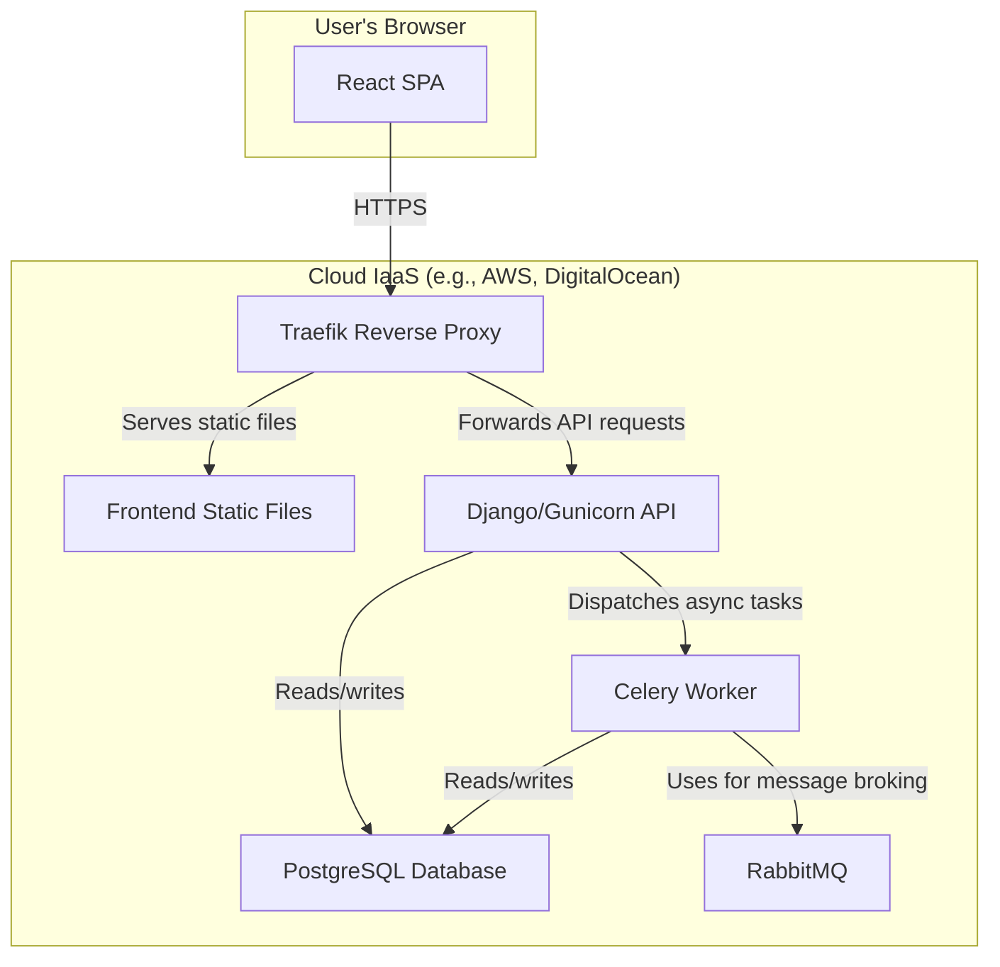

# High Level Architecture

## Technical Summary

The Shargain platform is designed as a decoupled system featuring a modern single-page application (SPA) frontend and a robust monolithic backend. The frontend is a React/TypeScript application built with Vite, communicating via a contract-first RESTful API defined with OpenAPI. The backend is a Django application utilizing Django Ninja for efficient API development and Celery for asynchronous task processing. The entire system is containerized using Docker, with Traefik managing ingress and routing in production, ensuring a scalable and maintainable architecture well-suited to the project's goals of providing a reliable second-hand item marketplace.

## Platform and Infrastructure Choice

**Platform:** Self-hosted Infrastructure as a Service (IaaS)
**Key Services:** Docker, Traefik, PostgreSQL, Gunicorn, Celery, RabbitMQ
**Deployment Host and Regions:** Single Linux Virtual Private Server (e.g., AWS EC2, DigitalOcean Droplet) in a primary region (e.g., `eu-central-1`).

## Repository Structure

**Structure:** Monorepo
**Monorepo Tool:** N/A (simple folder-based separation)
**Package Organization:** The project utilizes a simple monorepo structure with two primary top-level directories: `frontend/` for the React SPA and `shargain/` for the Django backend. There is currently no formal monorepo management tool (like Turborepo or Nx), as shared logic is minimal and the API contract serves as the primary interface.

## High Level Architecture Diagram

## Architectural Patterns

-   **Decoupled SPA + API:** The frontend is a standalone Single-Page Application that communicates with the backend exclusively through a stateless API.
    -   *Rationale:* This separation allows independent development, deployment, and scaling of the frontend and backend, promoting a clean division of concerns.
-   **Component-Based UI:** The React frontend is built as a collection of reusable, self-contained components.
    -   *Rationale:* This enhances maintainability, testability, and development speed, as complex UIs can be composed from simpler, independent parts.
-   **Asynchronous Task Processing:** Long-running or non-critical operations are delegated to background workers using Celery.
    -   *Rationale:* This ensures the main API remains responsive and provides a better user experience by not blocking web requests for heavy processing.
-   **API Gateway (Lightweight):** Traefik acts as a single entry point for all incoming traffic, routing to the appropriate service.
    -   *Rationale:* This centralizes concerns like SSL termination, routing, and load balancing, simplifying the architecture of the downstream services.
