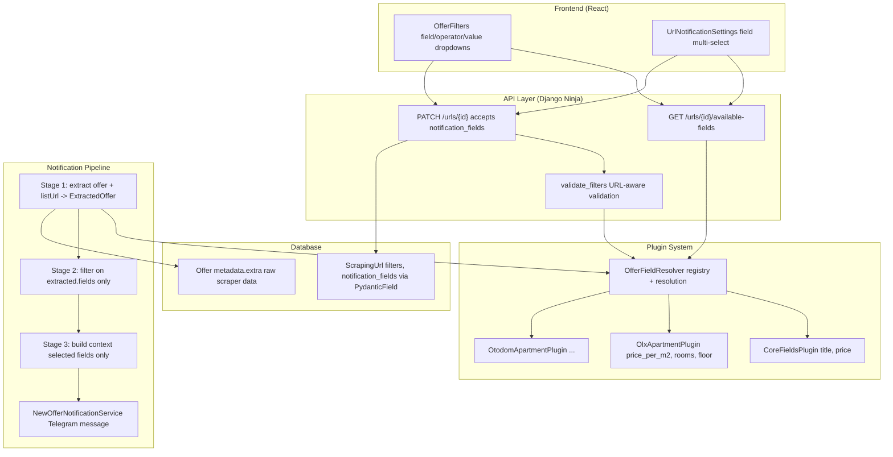
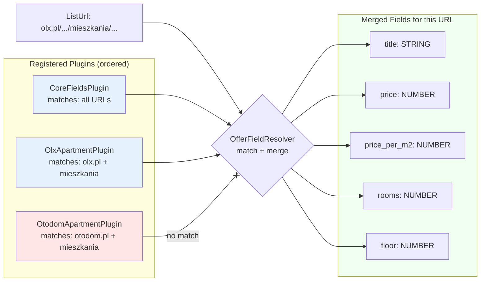
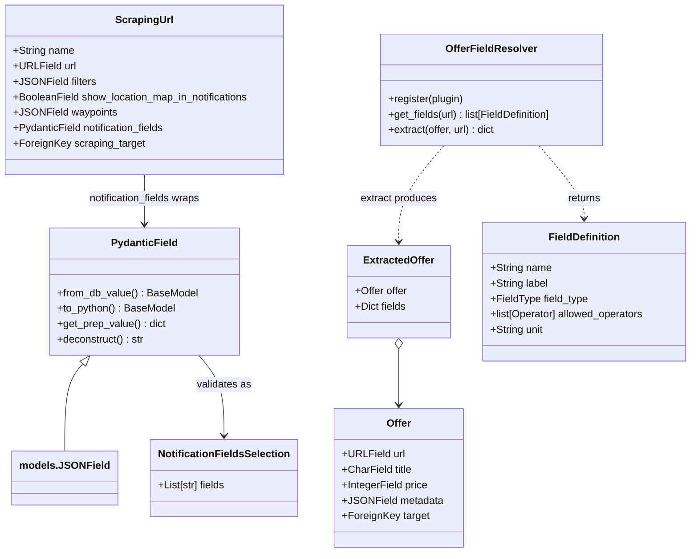
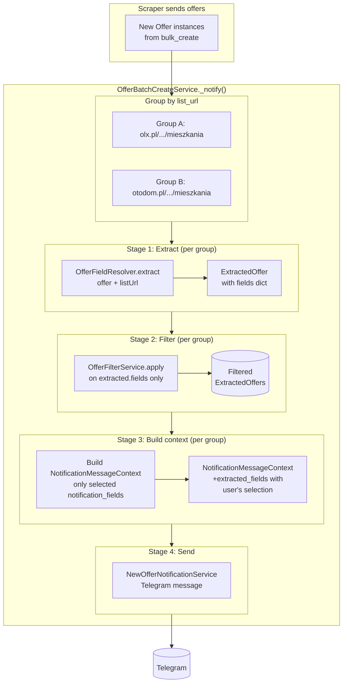
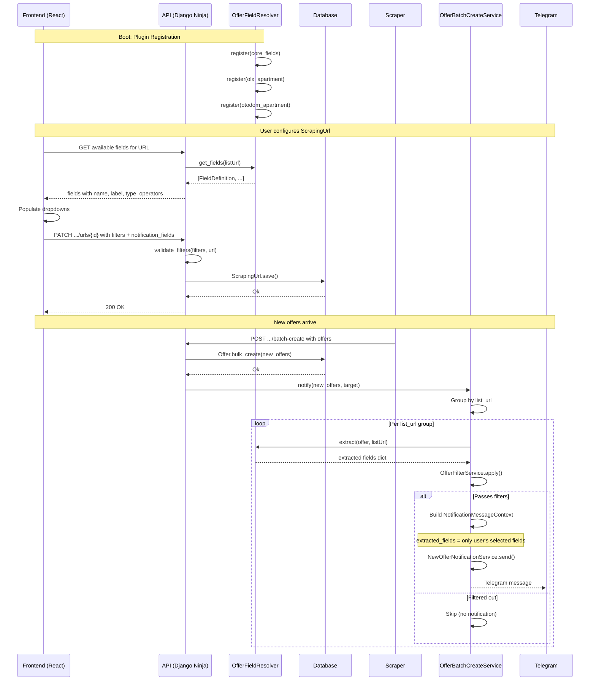

# Field Plugin System — Design Spec

## Status

Under review.

## Problem

Offers scraped from different websites carry domain-specific data (apartments have price/m², rooms, floor; cars have mileage, engine size, year). The current system:

- Only supports `title` as a filter field with `contains`/`not_contains` operators
- Has no way to expose domain-specific fields for filtering or notification messages
- Uses a hardcoded `LocationParserFactory` for location extraction that cannot be extended without modifying the factory

## Solution Overview

A plugin-based system where each plugin:

- Declares which listing URLs it matches
- Defines the fields it can extract (name, label, type, operators)
- Extracts typed values from `offer.metadata` at notification time

The system provides three capabilities:
1. **Schema**: what fields are available for a given listing URL (frontend consumes this)
2. **Extraction**: typed values from offers for filtering and notifications
3. **Validation**: filter rules and notification field selections are validated against available fields

## Architecture

### Component Overview



### Core Types

```python
from typing import NewType

ListUrl = NewType("ListUrl", str)  # Distinguish listing URLs from offer URLs


class FieldType(StrEnum):
    STRING = "string"
    NUMBER = "number"
    BOOLEAN = "boolean"


class Operator(StrEnum):
    CONTAINS = "contains"
    NOT_CONTAINS = "not_contains"
    EQUALS = "equals"
    NOT_EQUALS = "not_equals"
    GREATER_THAN = "greater_than"
    LESS_THAN = "less_than"
    GTE = "gte"
    LTE = "lte"


@dataclass(frozen=True)
class FieldDefinition:
    name: str                           # machine name, never translated
    label: str                          # human-readable, translatable via gettext_lazy
    field_type: FieldType
    allowed_operators: list[Operator] | None = None  # None = infer from field_type
    unit: str | None = None             # e.g. "zł/m²", translatable if needed


@dataclass
class ExtractedOffer:
    offer: Offer
    fields: dict[str, int | float | str | bool | None]
```

### Global Type-to-Operator Mapping

When a `FieldDefinition` has `allowed_operators=None`, operators are inferred:

```python
TYPE_OPERATORS: dict[FieldType, list[Operator]] = {
    FieldType.STRING: [
        Operator.CONTAINS, Operator.NOT_CONTAINS, Operator.EQUALS,
    ],
    FieldType.NUMBER: [
        Operator.EQUALS, Operator.NOT_EQUALS,
        Operator.GREATER_THAN, Operator.LESS_THAN,
        Operator.GTE, Operator.LTE,
    ],
    FieldType.BOOLEAN: [
        Operator.EQUALS,
    ],
}
```

Each `FieldType` assigns a human-readable label per operator. These labels are returned in the API so the frontend never needs its own mapping.

### Plugin Interface

```python
class BaseFieldPlugin(ABC):
    @abstractmethod
    def matches(self, url: ListUrl) -> bool:
        """Return True if this plugin supports the given listing URL."""

    @property
    @abstractmethod
    def fields(self) -> list[FieldDefinition]:
        """The fields this plugin can extract."""

    @abstractmethod
    def extract(self, offer: Offer, url: ListUrl) -> dict[str, Any]:
        """
        Return {field_name: value} for all declared fields.
        Return None for fields that cannot be extracted from this offer.
        """
```

Plugins are **singleton objects**, not classes. Each plugin module creates one instance:

```python
# source_plugins/olx_apartment.py
from shargain.offers.services.source_plugins.base import BaseFieldPlugin

class OlxApartmentPlugin(BaseFieldPlugin):
    def matches(self, url: ListUrl) -> bool:
        return "olx.pl" in url and "mieszkania" in url

    @property
    def fields(self) -> list[FieldDefinition]:
        return [
            FieldDefinition("price_per_m2", "Price per m²", FieldType.NUMBER, unit="zł/m²"),
            FieldDefinition("rooms", "Rooms", FieldType.NUMBER),
            FieldDefinition("floor", "Floor", FieldType.NUMBER),
        ]

    def extract(self, offer: Offer, url: ListUrl) -> dict[str, Any]:
        extra = offer.metadata.get("extra", {})
        params = extra.get("params", {})
        return {
            "price_per_m2": params.get("price_per_m2"),
            "rooms": params.get("rooms"),
            "floor": params.get("floor"),
        }

olx_apartment = OlxApartmentPlugin()
```

### CoreFieldsPlugin (Backward Compatibility)

A generic plugin matching all URLs provides `title` and `price` so existing title-based filters keep working:

```python
class CoreFieldsPlugin(BaseFieldPlugin):
    def matches(self, url: ListUrl) -> bool:
        return True

    @property
    def fields(self) -> list[FieldDefinition]:
        return [
            FieldDefinition("title", "Title", FieldType.STRING),
            FieldDefinition("price", "Price", FieldType.NUMBER, unit="zł"),
        ]

    def extract(self, offer: Offer, url: ListUrl) -> dict[str, Any]:
        return {"title": offer.title, "price": offer.price}

core_fields = CoreFieldsPlugin()
```

Registered first so it has lowest priority and existing filters continue to work.

### Plugin Resolution Strategy



First matching plugin's fields are canonical. Subsequent matching plugins fill gaps (undelcared fields). CoreFieldsPlugin matches all URLs and provides backward compat.

### OfferFieldResolver (Registry)

```python
class OfferFieldResolver:
    _plugins: list[BaseFieldPlugin] = []

    @classmethod
    def register(cls, plugin: BaseFieldPlugin) -> None:
        cls._plugins.append(plugin)

    @classmethod
    def get_fields(cls, url: ListUrl) -> list[FieldDefinition]:
        """Return merged field definitions from all matching plugins.

        Resolution: first matching plugin's fields are canonical.
        Subsequent matching plugins fill gaps (fields not yet declared).
        Registration order determines priority (first = highest).
        """
        ...

    @classmethod
    def extract(cls, offer: Offer, url: ListUrl) -> dict[str, Any]:
        """Extract values from all matching plugins for this offer.

        Resolution: first matching plugin's values are canonical.
        Subsequent plugins fill missing keys only.
        """
        ...
```

### Registration

In `shargain/offers/services/source_plugins/__init__.py`:

```python
from .core_fields import core_fields
from .olx_apartment import olx_apartment

registered_plugins = [core_fields, olx_apartment]
```

In `shargain/offers/apps.py`:

```python
def ready(self):
    from shargain.offers.services.source_plugins import registered_plugins
    from shargain.offers.services.offer_field_resolver import OfferFieldResolver
    for plugin in registered_plugins:
        OfferFieldResolver.register(plugin)
```

### Data Model Changes



### PydanticField (Custom Django Model Field)

A `PydanticField` extends `models.JSONField` to provide Pydantic-based validation and typing:

```python
BaseModelT = TypeVar("BaseModelT", bound=BaseModel)

class PydanticField(models.JSONField, Generic[BaseModelT]):
    def __init__(self, pydantic_model: type[BaseModelT], **kwargs):
        self.pydantic_model = pydantic_model
        super().__init__(**kwargs)

    def from_db_value(self, value, expression, connection) -> BaseModelT | None:
        if value is None:
            return None
        return self.pydantic_model.model_validate(value)

    def to_python(self, value) -> BaseModelT | None:
        if value is None:
            return None
        if isinstance(value, self.pydantic_model):
            return value
        return self.pydantic_model.model_validate(value)

    def get_prep_value(self, value) -> dict | None:
        if value is None:
            return None
        if isinstance(value, self.pydantic_model):
            return value.model_dump()
        return value

    def deconstruct(self):
        name, path, args, kwargs = super().deconstruct()
        kwargs["pydantic_model"] = (
            f"{self.pydantic_model.__module__}.{self.pydantic_model.__qualname__}"
        )
        return name, path, args, kwargs
```

Migration serialization uses dotted string paths. The field lazy-loads the Pydantic class at runtime.

Used for `notification_fields`:

```python
class NotificationFieldsSelection(BaseModel):
    fields: list[str]

class ScrapingUrl(models.Model):
    notification_fields: NotificationFieldsSelection | None = PydanticField(
        NotificationFieldsSelection,
        default=None, null=True, blank=True,
    )
```

Typing works via the django-stubs pattern — `instance.notification_fields` is typed as `NotificationFieldsSelection | None`.

### Pipeline Refactoring

The `_notify()` method in `OfferBatchCreateService` is refactored internally with clear stages. No new service class is needed.



**Stage 1 — Extraction:**

```python
def _extract(self, offers: list[Offer], list_url: ListUrl) -> list[ExtractedOffer]:
    return [
        ExtractedOffer(
            offer=offer,
            fields=OfferFieldResolver.extract(offer, list_url),
        )
        for offer in offers
    ]
```

**Stage 2 — Filtering:**

`OfferFilterService` now takes `list[ExtractedOffer]`. Rules resolve field names from `extracted.fields` instead of `getattr(offer, field)`. Supports all operators with type-aware comparison.

```python
class OfferFilterService:
    def apply(self, extracted_offers: list[ExtractedOffer]) -> list[ExtractedOffer]: ...
```

**Stage 3 — Context Building:**

Only selected fields (from `ScrapingUrl.notification_fields`) are included:

```python
def _build_contexts(self, extracted_offers, scraping_url):
    selected = set(scraping_url.notification_fields.fields) if scraping_url.notification_fields else set()
    contexts = []
    for extracted in extracted_offers:
        contexts.append(NotificationMessageContext(
            offer=extracted.offer,
            extracted_fields={
                k: v for k, v in extracted.fields.items() if k in selected
            },
        ))
    return contexts
```

**Stage 4 — Notification Service Changes:**

`NotificationMessageContext` gains a new field:

```python
@dataclass
class NotificationMessageContext:
    offer: Offer
    map_url: str | None = None
    location_name: str | None = None
    is_exact_location: bool = False
    distances: list[tuple[str, float]] = field(default_factory=list)
    extracted_fields: dict[str, int | float | str | bool | None] = field(default_factory=dict)  # NEW
```

`get_message_for_offer()` appends selected fields as key-value pairs after the existing location block:

```
APARTAMENT NA WYNAJEM

Mieszkanie 2 pokoje (12:30)
za 3500zł
https://olx.pl/oferta/123

📍 https://maps.google.com/...
🏙️ Warszawa, Mokotów
📏 1.2 km from Metro

🏷️ Price per m²: 42 zł/m²
🏷️ Rooms: 3
🏷️ Floor: 4
```

Format rules:
- Each field renders as `"🏷️ {label}: {value}{unit}"` (or `"🏷️ {label}: Yes/No"` for booleans)
- Extracted fields appear last, after location data
- If a field name is not found in the plugin's field definitions, it is skipped
- The field's `label` from `FieldDefinition` is used (already translated), not the machine name

### OfferBatchCreateService Changes

`OfferBatchCreateService` retains its role. The `_notify()` method is refactored internally with clear private methods instead of one monolithic block:

| Before | After |
|---|---|
| `_notify()` has grouping, filtering, location parsing, message building all inline | `_notify()` calls `_extract()`, `_filter()`, `_build_contexts()` as separate steps |
| Offer creation and notification logic are mixed in `run()` | Same `run()` flow, but `_notify()` is decomposed into smaller methods |

The refactored `_notify()` structure:

```python
def _notify(self, new_offers, scrapping_target):
    if not (new_offers and scrapping_target.notification_config and scrapping_target.enable_notifications):
        return

    offers_by_url = self._group_by_url(new_offers)
    scraping_urls = self._fetch_scraping_urls(offers_by_url.keys(), scrapping_target)
    url_to_config_map = {sc.url: sc for sc in scraping_urls}

    for list_url, url_offers in offers_by_url.items():
        scraping_url = url_to_config_map.get(list_url)

        extracted = self._extract(url_offers, list_url)
        filtered = self._filter(extracted, scraping_url)
        if not filtered:
            continue

        contexts = self._build_contexts(filtered, scraping_url)
        self._send_notifications(contexts, scrapping_target, scraping_url)
```

The old `_notify()` method (and imports for `NotificationMessageContext`, `OfferFilterService`, `LocationParserFactory`) are replaced with this decomposed version.

### API Layer

**New endpoint:**

```
GET /api/public/urls/{url_id}/available-fields
```

Response schema:

```json
{
    "fields": [
        {
            "name": "price_per_m2",
            "label": "Price per m²",
            "type": "number",
            "unit": "zł/m²",
            "operators": [
                {"value": "equals", "label": "Equals"},
                {"value": "greater_than", "label": "Greater than"},
                {"value": "less_than", "label": "Less than"}
            ]
        }
    ]
}
```

**Updated endpoint:**

`PATCH /api/public/targets/{target_id}/urls/{url_id}` accepts new field:

```python
class UpdateScrapingUrlRequest(BaseSchema):
    filters: FiltersConfigSchema | None = None
    show_location_map_in_notifications: bool | None = None
    waypoints: list[WaypointSchema] | None = None
    notification_fields: list[str] | None = None  # NEW
```

**Validation:**

Filter validation (`validate_filters`) becomes URL-aware. It fetches available fields from `OfferFieldResolver.get_fields(url)` and validates:

- Each `rule.field` exists in available fields
- Each `rule.operator` is in the field's `allowed_operators`
- Each `rule.value` type matches the field's `field_type`

### Frontend Changes

All frontend API types and SDK functions are auto-generated from the Django Ninja OpenAPI schema via `@hey-api/openapi-ts`. The changes below reference generated types assuming they exist after regeneration.

#### New generated types & SDK

After adding the endpoint `GET /api/public/urls/{url_id}/available-fields` to the backend and running `pnpm -C frontend api:generate-types`, the generated client provides:

- **`getAvailableFields()`** in `sdk.gen.ts` — the SDK function to call the endpoint
- **`AvailableFieldsResponse`** and **`AvailableFieldSchema`** in `types.gen.ts` — response types
- **`ScrapingUrlResponse.notificationFields`** in `types.gen.ts` — from the `UpdateScrapingUrlRequest` schema

No manual type definitions are needed.

#### New API hook: `useAvailableFields`

A React Query hook wraps the generated SDK function:

```typescript
import { getAvailableFields } from "@/lib/api/sdk.gen";
import type { AvailableFieldsResponse } from "@/lib/api/types.gen";

export function useAvailableFields(urlId: number | null) {
    return useQuery<AvailableFieldsResponse>({
        queryKey: ['availableFields', urlId],
        queryFn: () => getAvailableFields({ path: { url_id: urlId! } }).then(r => r.data!),
        enabled: urlId !== null,
        staleTime: 60_000,
    });
}
```

#### OfferFilters.tsx — dynamic field/operator/value

The `updateScrapingUrl` generated SDK function already supports `filters`. No changes to the mutation hook — only the props and rendering logic change.

- On mount (or when the collapsible opens), fetches `useAvailableFields(urlId)`
- Field `<Select>` populated from API response — each rendered as `<SelectItem value={field.name}>{field.label}</SelectItem>`
- When user picks a field, the operator `<Select>` updates to show only that field's `operators` array (using `label` for display, `value` for submission)
- Value input changes type based on `field.type`:
  - `"string"` → `<Input type="text" />`
  - `"number"` → `<Input type="number" />`
  - `"boolean"` → `<Select>` with "Yes"/"No" options
- Creating a new empty rule defaults to the first available field (instead of hardcoded `"title"`)
- Loading state: spinner while fields are loading
- Error state: retry button
- Empty state: "No fields available for this URL" if the response has an empty list

#### filterValidation.ts — dynamic Zod schemas

The factory function `createFilterSchemas` accepts available fields from the API instead of hardcoded const enums. The generated `AvailableFieldSchema` type is used:

```typescript
import type { AvailableFieldSchema } from "@/lib/api/types.gen";

export const createFilterSchemas = (t: TFunction, availableFields?: AvailableFieldSchema[]) => {
    const fieldNames = (availableFields?.map(f => f.name) ?? ["title"]) as [string, ...string[]];
    // Zod enum for field is built from the dynamic list
    // Operator is validated at submit, not in the schema
    // Value becomes z.union([z.string(), z.number()])
};
```

#### UrlNotificationSettings.tsx — new field selection section

The generated `ScrapingUrlResponse` type already includes `notificationFields` (from the backend schema). The existing `useGetTarget` hook already returns this data. Changes:

- `url.notificationFields` is passed from the parent `MonitoredWebsites` component
- Fetches `useAvailableFields(urlId)` to show the multi-select checklist
- On save, sends `{ notificationFields: [...] }` via the existing PATCH — the generated `updateScrapingUrl` SDK function already supports this field
- Empty state: if no fields are available for this URL, show "No additional fields available" and hide the section

Type generation automatically propagates `notificationFields` to:
- `ScrapingUrlResponse` (for the GET response)
- `UpdateScrapingUrlRequest`/`UpdateScrapingUrlPayload` (for the PATCH body)
- No manual type updates needed

### Internationalization (i18n)

All user-facing labels returned by the API must be translatable:

- **Field `label`** (e.g., "Price per m²") — translated by the backend based on the request's locale. Plugins define labels using Django's `gettext_lazy()` so they are resolved to the active language at serialization time. Alternatively, plugins return a dictionary of `{locale: label}` pairs and the API selects the matching one.

- **Operator `label`** (e.g., "Greater than") — follows the same pattern as field labels. Each `Operator` enum value maps to a translatable label resolved at the API layer.

- The frontend receives fully resolved labels and renders them directly. No frontend-side i18n mapping for plugin fields is needed.

- Field `name` (machine name, e.g., `"price_per_m2"`) is always in English and never translated. It is used for filter configuration and notification field selection in the API payloads.

### Data Flow Summary



### Scope & Constraints

- **In scope**: plugin interface, OfferFieldResolver, CoreFieldsPlugin, PydanticField, `_notify()` refactoring (extract/filter/build/send stages), API endpoint, filter service update, notification message update, frontend dynamic field loading and field selection
- **Out of scope**: migration of existing location parsers into plugins, Discord notification channel, notification template editor
- **Backward compatibility**: existing title-only filters continue working via CoreFieldsPlugin
